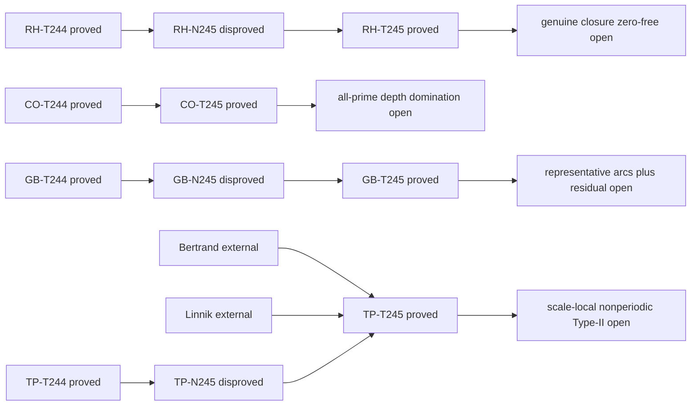

# TICKET-245: closure margin, 2차 Fermat digit, Klein arc orbit, Linnik 높이 모방

## 상태 선언

- `iteration_complete`: true
- `resolved_count`: 0
- `candidate_resolution_count`: 0
- `new_partial_theorem_count`: 2
- `exact_no_go_count`: 2
- `stagnated_problem_count`: 0
- deep focus: 쌍둥이 소수
- parent: TICKET-244
- 프로그램 상태: `open_not_proven`

이번 회차는 네 개의 보조 명제를 증명했다. 리만 가설, 콜라츠 추측,
강한 골드바흐 추측, 쌍둥이 소수 추측 중 어느 것도 증명하거나 반증하지
않았다. 통합 기계 판독 기록은
`data/open-problem/ticket245-closure-second-order-klein-linnik.json`이다.

## 재현 계약

```powershell
python scripts/ticket245_closure_second_order_klein_linnik.py
python -m unittest tests.test_ticket245_closure_second_order_klein_linnik -v
python scripts/verify_ticket245_structure.py
python scripts/verify_open_problem_structure.py
node --check assets/ticket245-open-problem.js
node --check assets/open-problems.js
node scripts/verify_pages.cjs
```

정리 판정 계산은 모두 정수 또는 정확한 유리수 산술을 사용한다. JSON의
`float` 동반 필드는 표시용이며 증명에는 쓰이지 않는다. 모든 계산은
결정적이므로 random seed는 없다.

| 문제 | 이번 선언 명제 | 분류 | 원문제 상태 |
|---|---|---|---|
| 리만 가설 | compact closure가 zero set을 피할 때와 그때만 연속 비음수 함수가 균일 양의 margin을 갖는다. joint tightness와 점별 양성만으로는 부족하다 | `exact_no_go` | `open_not_proven` |
| 콜라츠 | 두 고정 유리 Wieferich depth의 정확한 2차 Fermat-digit 판정식 | `partial_theorem` | `open_not_proven` |
| 강한 골드바흐 | 짝수 표적 이항 적분함수의 Klein four 대칭과 quarter-torus 유리 중심 환원 | `partial_theorem` | `open_not_proven` |
| 쌍둥이 소수 | 모든 고정 주기 특징은 주기의 다항식 높이 이하에서 prime/composite-successor 모방자를 갖는다 | `exact_no_go` | `open_not_proven` |

## 1. 리만 가설

### A. 정확한 명제

실수 짝함수 부분공간 `L2(R)`에서

```text
e0 = 2^(-1/2) 1_[-1,1],
e1 = 2^(-1/2) 1_([-2,-1] union [1,2])
```

로 두고, `0<t<=1`에 대해

```text
f_t = (t e0+e1)/sqrt(1+t^2),
K   = {f_t:0<t<=1},
Q(f)=|<f,e0>|^2
```

로 둔다. 그러면 `K`는 유계이고 상대 compact이며 물리공간과
Fourier 공간에서 공동 tight하다. `Q`는 연속이고 모든 `f in K`에서
양수지만

```text
inf_(f in K) Q(f)=0.
```

compact 집합 `K_m={f_t:1/m<=t<=1}`은 `K`를 소진하며

```text
min_(f in K_m) Q(f)=1/(m^2+1).                         (RH-245.1)
```

더 일반적으로 공집합이 아닌 상대 compact 집합 `A`와 연속 함수 `Q>=0`에
대해

```text
inf_A Q>0  iff  closure(A) ∩ Q^(-1)(0)=empty.          (RH-245.2)
```

### B-D. 정의와 증명

`e0,e1`의 지지는 끝점을 제외하면 서로 겹치지 않고 각각 길이가 2이므로
정규화된 실수 짝함수이며 서로 직교한다. `t -> f_t`는 `[0,1]`까지
연속으로 확장되므로 그 상이 `K`의 compact closure이다. 따라서
TICKET-244의 joint-tail compactness 정리를 적용할 수 있다. 또는 공통 compact
지지와 고정 2차원 부분공간에서 직접 공동 tightness를 얻을 수 있다.

직교성으로

```text
Q(f_t)=t^2/(1+t^2)
```

이다. 이는 `t>0`에서 양수이고 `t->0`에서 0으로 가며 증가하므로
(RH-245.1)을 얻는다. (RH-245.2)에서 infimum이 0인 수열은 compact
closure 안에서 수렴 부분수열을 갖고, 연속성에 의해 극한은 zero set에
속한다. 역방향은 closure 정의로 즉시 따른다. compact closure가 닫힌
zero set을 피하면 `Q`는 엄밀한 양의 최솟값을 갖는다.

### E-G. 반례와 재현 계산

이 exact counterfamily는 다음 경로 명제를 반증한다.

> joint tightness와 점별 양성, 또는 compact 소진 단계마다의 양의 margin만으로
> 하나의 균일 양의 margin을 얻을 수 있다.

`m=2,4,8,16,32,64`에서 exact margin은

```text
1/5, 1/17, 1/65, 1/257, 1/1025, 1/4097
```

이다. 생성기는 `O(6)` 유리수 연산으로 여섯 행을 확인하며 실패는 0이다.
transcript SHA-256은
`5e329477cb0a2f420f406b1b9f94483f36d9026bb1ef22542c31b68ac139cbb1`이다.

### H-K. 한계, 판정, 다음 보조정리

이 family는 추상적인 실수 짝함수 `L2` family이며 실제 정규화된
Guinand-Weil admissible class에 속한다고 증명되지 않았다. 실제 Weil
closure가 zero-functional 점을 포함한다는 주장도 하지 않는다. no-go의
범위는 compactness에서 margin으로 넘어가는 논리적 승격뿐이다.

- 결과: `exact_no_go`
- 폐기 경로: closure separation 없는 joint tightness와 점별/단계별 양성
- 남은 최소 간극: 실제 admissible closure가 해당 Weil 함수의 zero set을
  피함을 증명
- 다음 단일 보조정리:
  `ZeroFreeClosureSeparationForNormalizedAdmissibleWeilFunctional`

## 2. 콜라츠 추측

### A. 정확한 명제

모든 소수 `q>5`에 대해 정수 Fermat quotient를

```text
U=(2^(q-1)-1)/q,  V=(3^(q-1)-1)/q
```

로 두고 modulo `q^2`에서 읽는다. 그러면

```text
q^3 | 32^(q-1)-27^(q-1)
iff 5U-3V+q(10U^2-3V^2)=0 mod q^2,                 (CO-245.1)

q^3 | 2^(q-1)-3^(q-1)
iff U-V=0 mod q^2.                                  (CO-245.2)
```

modulo `q`로 내리면 TICKET-244의 두 first-layer line을 되찾는다.

### B-D. 정의와 증명

정확히

```text
2^(q-1)=1+qU,  3^(q-1)=1+qV
```

로 쓸 수 있다. modulo `q^3`에서 이항정리는

```text
(1+qU)^5 = 1+5qU+10q^2U^2,
(1+qV)^3 = 1+3qV+ 3q^2V^2
```

를 준다. 두 식을 빼고 `q`로 나누면 (CO-245.1)을 얻는다. 두 base power를
직접 빼면 (CO-245.2)를 얻는다. `U,V mod q^2`만 필요하다. `q>5`이므로
base나 분모가 0이 되는 예외는 없다.

### E-G. 적대적 탐색과 exact replay

first-layer bad-line 반례 탐색은 sieve와 modulo `q^2` 거듭제곱으로
`5<q<=20,000,000`인 소수 `1,270,604`개를 모두 검사했다.

```text
5F_q(2)-3F_q(3)=0 mod q: 없음
 F_q(2)- F_q(3)=0 mod q: q=23 하나
```

별도로 `q<=50,000`인 소수 `5,130`개에 대해 modulo `q^3` replay를 수행했다.
공식 결과를 직접 modular exponentiation과 비교해 identity failure 0을
얻었다. `q=23`은 comparison line이 첫 층에서 성립하지만 depth 3에서는
실패하므로 경계조건을 실제로 검사한 사례다.

sieve 복잡도는 `B=20,000,000`에 대해 `O(B log log B)` 시간과 `O(B)`
byte이며 modular power는 `O(pi(B) log B)` modular multiplication이다.
모든 산술은 exact integer이다. 2차 transcript hash는
`26b7da7bc74a887b9b954122bc61dfc4277277cbde99e063505e8d6ebbd1423f`이다.

### H-K. 한계, 판정, 다음 보조정리

2천만 이하에서 first bad-line 소수가 없다는 사실은 유한 증거이지
all-prime 정리가 아니다. 해당 구간에는 bad branch가 없으므로 유한 replay로
그 분포를 알 수 없다. 두 공식은 주어진 소수의 depth 3을 판정하지만 임의
depth를 제어하지 않는다. 모든 소수에서 고정 base depth domination을
증명하더라도 이 run-block 국소 경로만 닫히며 일반 Collatz 궤도나 비자명
cycle은 남는다.

- 결과: `partial_theorem`
- 새 폐기 경로: 없음. 유한 비출현을 승격하지 않음
- 남은 최소 간극: 실제 두 rational Wieferich depth의 all-prime 비교
- 다음 단일 보조정리: `FixedBaseAllPrimeRationalWieferichDepthDomination`

## 3. 강한 골드바흐 추측

### A. 정확한 명제

홀수 소수에 대해

```text
O_X(alpha)=sum_(3<=p<=X) exp(2 pi i p alpha)
```

로 두고, 짝수 `N`에 대해

```text
I_(X,N)(alpha)=O_X(alpha)^2 exp(-2 pi i N alpha)
```

로 둔다. `R/Z`에서 `h(alpha)=alpha+1/2`, `r(alpha)=-alpha`라 하면

```text
I after h = I,       I after r = conjugate(I).          (GB-245.1)
```

측도 0 경계를 제외하고 `E,hE,rE,hrE`가 서로소인 모든 가측집합 `E`에 대해

```text
integral_(E union hE union rE union hrE) I
  =4 Re integral_E I.                                  (GB-245.2)
```

모든 유리 중심은 `[0,1/4]`에 대표를 갖는다. `0`과 `1/4`의 orbit만 크기
2이고 나머지는 모두 크기 4이다.

### B-D. 정의와 증명

TICKET-244는 `O_X(alpha+1/2)=-O_X(alpha)`를 증명했다. 제곱하면 부호가
사라지고 짝수 `N`에서 `exp(-pi i N)=1`이므로 `h` 불변성을 얻는다. 소수
weight가 실수이므로 `O_X(-alpha)=conjugate(O_X(alpha))`이고 표적 phase도
같은 방식으로 변해 reflection 식을 얻는다.

Haar measure는 두 변환 아래 불변이다. `J=integral_E I`라 하면 네 적분은
`J,J,conjugate(J),conjugate(J)`이므로 (GB-245.2)가 성립한다. `h,r`는
서로 교환하는 involution이다. half turn으로 한 번, reflection으로 한 번
접으면 `[0,1/4]` 대표를 얻는다. 비자명 stabilizer는 `0 mod 1/2` 또는
`1/4 mod 1/2`에서만 생긴다.

### E-G. exact 유리 중심 열거

`Q=8,16,32,64,128` 각각에서 분모 `Q` 이하의 모든 기약 유리 seed를
열거하고 네 변환으로 닫은 뒤, exact `Fraction`으로 orbit closure와
stabilizer 분류를 확인했다. `Q=128` 결과는 다음과 같다.

```text
seed 5,022개
Klein closure 중심 7,524개
quarter-torus 정규 orbit 1,882개
크기 2 orbit 2개, 크기 4 orbit 1,880개
변환 후 최대 분모 254
```

실패는 0이다. 열거는 `O(Q^2 log Q)` 시간과 `O(Q^2)` 유리 중심 저장공간을
쓴다. transcript SHA-256은
`92774e213632ee5eb153236bafe3c0b03ec914994db4b4b668b22224c52d6639`이다.

### H-K. 한계, 판정, 다음 보조정리

이 항등식은 중복된 signed 분석을 제거할 뿐 정규 대표 arc 자체를 추정하지
않는다. half turn은 기약 분모를 두 배로 만들 수 있고, 실제 arc 폭은 네
상이 서로소가 되도록 별도로 정해야 한다. minor-arc saving이나 양의
Goldbach 하한은 나오지 않는다.

- 결과: `partial_theorem`
- 폐기 경로: 네 대칭 유리 arc를 독립 signed quantity로 추정
- 남은 최소 간극: 필요한 모든 orbit의 한 대표에 대한 균일 asymptotic과
  signed residual saving
- 다음 단일 보조정리:
  `UniformRepresentativeArcAsymptoticAndSignedResidualSavingOnQuarterTorus`

## 4. 쌍둥이 소수 추측 — deep focus

### A. 정확한 명제

절대상수 `C,L>0`가 존재하여 모든 정수 `M>=1`, 다음을 만족하는 모든
`a mod M`,

```text
gcd(a,M)=gcd(a+2,M)=1,
```

그리고 `(n,n+2) mod M`에만 의존하는 모든 특징 `F`에 대해

```text
p <= C M^(3L)
```

인 소수 `p`가 존재하며 `F(p,p+2)=F(a,a+2)`이지만 `p+2`는 합성수다.
따라서 admissible class 하나를 받아들이는 순수 `M`-주기 분류기는
`X>=C M^(3L)`인 전역 prefix 전체에서 sound할 수 없다.

### B-D. 정의, 외부 전제, 증명

`M>=2`이면 Bertrand 정리로 서로 다른 소수

```text
M<ell_1<2M,  2M<ell_2<4M
```

를 택한다. `M=1`에서는 `ell_1=3,ell_2=5`를 쓴다. CRT로

```text
r=a mod M,
r=-2 mod ell_1,
r=-2 mod ell_2,
Q=M ell_1 ell_2 < 8M^3                              (TP-245.1)
```

을 만족하는 reduced class `r mod Q`를 얻는다. Linnik 최소소수 정리는
절대상수 `C_0,L`과 `p=r mod Q`, `p<=C_0Q^L`인 소수를 준다. `8^L`과
`M=1` 경우를 `C`에 흡수한다. `p+2`는 서로 다른 두 소수
`ell_1 ell_2`의 양의 배수이므로 합성수이고 modulo `M` 합동은 `F`를
보존한다. prefix-period 하한은 이 명제의 대우다.

양화사 순서는 중요하다. `M,a,F`를 먼저 고정하고 Linnik 정리가 `p`를
제공한다. 상수는 이 선택들에 의존하지 않는다.

### E-G. exact witness

결정적 witness 다섯 개를 저장했다.

| M | a | ell_1 | ell_2 | 소수 p | p+2의 인수분해 |
|---:|---:|---:|---:|---:|---|
| 1 | 0 | 3 | 5 | 13 | `3*5*1` |
| 30 | 11 | 31 | 61 | 138,041 | `31*61*73` |
| 210 | 11 | 211 | 421 | 19,809,311 | `211*421*223` |
| 2,310 | 17 | 2,311 | 4,621 | 271,559,622,197 | `2311*4621*25429` |
| 30,030 | 17 | 30,047 | 60,077 | 239,904,063,098,717 | `30047*60077*132901` |

CRT와 인수분해는 exact integer이다. 소수 판정은 unsigned 64-bit에서
결정적인 Miller-Rabin base set으로 replay한다. 각 등차수열 탐색은 첫
소수까지 `k`개 후보를 검사할 때 `O(k log^3 p)` bit operation을 쓴다.
다섯 행은 예시이며 보편 다항 높이의 증명은 Linnik 정리에 의존한다.
실패 0, transcript SHA-256은
`9c40a7487d40b111bb2e9ebc9c4bc9cbcf4edaf9ed73d931632d5df78bd32e98`이다.

### H-K. 한계, no-go, 다음 보조정리

정리는 전역 prefix에서 재사용하는 고정 주기를 다룬다. 각 dyadic block에
새 superpolylog modulus를 선택할 때 그 block 안에 모방자를 배치하지는
못한다. 비주기 정보, Type-I/II 합, 양의 twin-prime mass도 다루지 않는다.

- 결과: `exact_no_go`
- 폐기 경로: 고정 순수 주기 분류기가 자기 주기의 모든 다항 높이를 넘어
  prefix-sound하다는 경로
- 남은 최소 간극: scale-local 비주기 parity-breaking cancellation
- 다음 단일 보조정리:
  `ScaleLocalNonperiodicTypeIICancellationBeyondPeriodicHeightBarriers`

## 적대적 증명 감사

| 감사 항목 | 결과 |
|---|---|
| 점별 양성과 균일 양성 | `f_t -> f_0` closure 경계로 명시적으로 분리 |
| 유한 검사에서 무한 결론 승격 | Collatz·유리 orbit·witness 해석에서 금지 |
| 양화사 순서 | Linnik 명제에 명시했고 scale-local modulus와 교환하지 않음 |
| 경계값과 예외류 | `q>5`, `M=1`, 크기 2 orbit 둘, `q=23`을 별도 처리 |
| 0 분모·CRT 불일치 | base 소수로 `q=2,3,5` 제외, CRT modulus는 서로소이며 class는 reduced |
| 외부 정리의 전제 | Bertrand는 양의 정수에, Linnik은 reduced residue class에 적용 |
| proof DAG 순환 | 0; 각 트랙 open frontier 하나 |
| 해결 과장 | machine resolution과 candidate-resolution count 모두 0 |

문제 사이의 증명 전달은 주장하지 않는다. compactness margin, Fourier
대칭, 주기 모방은 각각 자기 정의역에서만 사용하며 유사성은 방법론적이다.

## Proof DAG



마지막 frontier node는 모두 `open`이며 assumption이나 proved theorem으로
몰래 취급하지 않았다.

## 1차 자료와 적용 범위

- [Clay Mathematics Institute: 리만 가설](https://www.claymath.org/millennium/Riemann-Hypothesis/)
- [함수공간 compactness 기준](https://arxiv.org/abs/2204.14237)
- [Sondow의 Fermat quotient와 Wieferich prime](https://arxiv.org/abs/1110.3113)
- [Tao의 거의 모든 Collatz 궤도 정리](https://arxiv.org/abs/1909.03562)
- [Helfgott의 circle-method major-arc 구조](https://arxiv.org/abs/1205.5252)
- [Xylouris의 Linnik 상수](https://arxiv.org/abs/0906.2749)
- [소수 생성 sieve의 parity 한계](https://arxiv.org/abs/1407.4897)

이 자료들은 외부 맥락이다. PrimeProject가 주장하는 것은 위에서 정확히
명시한 네 보조 결과, 계산, 경로 판정뿐이다.
