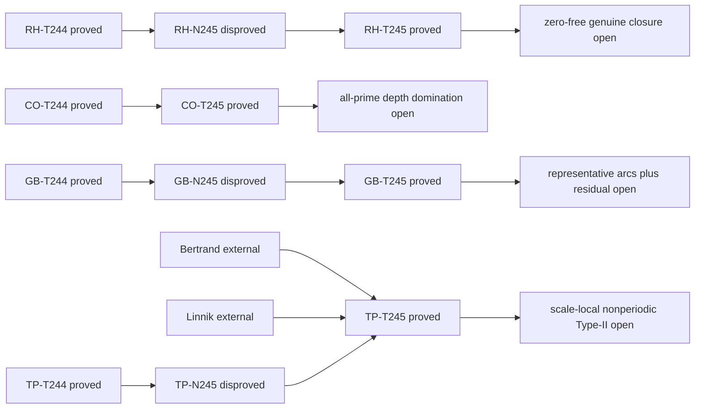

# TICKET-245: closure margins, second Fermat digits, Klein arc orbits, and Linnik-height mimicry

## Status declaration

- `iteration_complete`: true
- `resolved_count`: 0
- `candidate_resolution_count`: 0
- `new_partial_theorem_count`: 2
- `exact_no_go_count`: 2
- `stagnated_problem_count`: 0
- deep focus: Twin Prime
- parent: TICKET-244
- program status: `open_not_proven`

This iteration proves four auxiliary statements. It does **not** prove or
disprove the Riemann hypothesis, the Collatz conjecture, strong Goldbach, or
the twin-prime conjecture. The integrated machine record is
`data/open-problem/ticket245-closure-second-order-klein-linnik.json`.

## Reproduction contract

```powershell
python scripts/ticket245_closure_second_order_klein_linnik.py
python -m unittest tests.test_ticket245_closure_second_order_klein_linnik -v
python scripts/verify_ticket245_structure.py
python scripts/verify_open_problem_structure.py
node --check assets/ticket245-open-problem.js
node --check assets/open-problems.js
node scripts/verify_pages.cjs
```

All theorem-bearing calculations use integers or exact rational arithmetic.
The JSON `float` companions to rational values are display fields and are not
used as proof. There is no random seed because every computation is
deterministic.

| Problem | declared result | classification | parent status |
|---|---|---|---|
| Riemann | compact closure avoids the zero set iff a continuous nonnegative functional has a uniform positive margin; joint tightness and pointwise positivity alone fail | `exact_no_go` | `open_not_proven` |
| Collatz | exact second-order Fermat-digit criteria for the two fixed rational Wieferich depths | `partial_theorem` | `open_not_proven` |
| Strong Goldbach | even-target binary integrands reduce by a Klein four symmetry to rational centers in the quarter torus | `partial_theorem` | `open_not_proven` |
| Twin Prime | every fixed periodic twin feature has a prime/composite-successor mimic below a polynomial height in its period | `exact_no_go` | `open_not_proven` |

## 1. Riemann hypothesis

### A. Exact proposition

Let

```text
e0 = 2^(-1/2) 1_[-1,1],
e1 = 2^(-1/2) 1_([-2,-1] union [1,2])
```

in the real-even subspace of `L2(R)`. For `0<t<=1`, put

```text
f_t = (t e0+e1)/sqrt(1+t^2),
K   = {f_t:0<t<=1},
Q(f)=|<f,e0>|^2.
```

Then `K` is bounded, relatively compact, and jointly tight in physical and
Fourier space. The functional `Q` is continuous and positive at every point of
`K`, but

```text
inf_(f in K) Q(f)=0.
```

The compact sets `K_m={f_t:1/m<=t<=1}` exhaust `K` and have exact margin

```text
min_(f in K_m) Q(f)=1/(m^2+1).                         (RH-245.1)
```

More generally, if nonempty `A` is relatively compact in a metric space and
`Q>=0` is continuous, then

```text
inf_A Q>0  iff  closure(A) intersects Q^(-1)(0) trivially. (RH-245.2)
```

### B-D. Definitions and proof

The supports of `e0` and `e1` are disjoint up to endpoints, each has measure
two, and the prefactor normalizes both functions. They are real-even and
orthogonal. The map `t -> f_t` extends continuously to `[0,1]`; hence its image
is the compact closure of `K`. TICKET-244's joint-tail compactness theorem then
implies physical-frequency tightness. It can also be checked directly because
the family lies in one fixed two-dimensional subspace and has common compact
physical support.

Orthogonality gives

```text
Q(f_t)=t^2/(1+t^2).
```

This is positive for `t>0`, tends to zero as `t` tends to zero, and is
increasing, proving (RH-245.1). For (RH-245.2), an infimum-zero sequence in `A`
has a subsequence converging in the compact closure. Continuity puts its limit
in the zero set. Conversely, any zero in the closure is approached by points
of `A`. If the compact closure misses the closed zero set, `Q` attains a
strictly positive minimum.

### E-G. Counterexample and reproducible calculation

The exact counterfamily disproves the route statement

> joint tightness plus pointwise positivity, or positive margins on every
> compact exhaustion stage, automatically gives one uniform positive margin.

For `m=2,4,8,16,32,64`, the exact margins are

```text
1/5, 1/17, 1/65, 1/257, 1/1025, 1/4097.
```

The generator performs `O(6)` rational operations and records six successful
rows, zero failures, and transcript SHA-256
`5e329477cb0a2f420f406b1b9f94483f36d9026bb1ef22542c31b68ac139cbb1`.

### H-K. Limit, decision, and next lemma

This is an abstract real-even `L2` family. It is not proved to lie in the
normalized Guinand-Weil admissible class, and no claim is made that the genuine
Weil closure contains a zero-functional point. The no-go concerns the proposed
compactness-to-margin inference only.

- result: `exact_no_go`
- retired route: joint tightness plus pointwise/classwise positivity without
  closure separation
- remaining minimum gap: prove the actual admissible closure avoids the zero
  set of the relevant Weil functional
- next single lemma:
  `ZeroFreeClosureSeparationForNormalizedAdmissibleWeilFunctional`

## 2. Collatz conjecture

### A. Exact proposition

For every prime `q>5`, define the integer Fermat quotients

```text
U=(2^(q-1)-1)/q,  V=(3^(q-1)-1)/q,
```

read modulo `q^2`. Then

```text
q^3 | 32^(q-1)-27^(q-1)
iff 5U-3V+q(10U^2-3V^2)=0 mod q^2,                 (CO-245.1)

q^3 | 2^(q-1)-3^(q-1)
iff U-V=0 mod q^2.                                  (CO-245.2)
```

Modulo `q`, these recover the two first-layer lines in TICKET-244.

### B-D. Definitions and proof

Write exactly

```text
2^(q-1)=1+qU,  3^(q-1)=1+qV.
```

Modulo `q^3`, the binomial theorem gives

```text
(1+qU)^5 = 1+5qU+10q^2U^2,
(1+qV)^3 = 1+3qV+ 3q^2V^2.
```

Subtracting and dividing by `q` proves (CO-245.1). Direct subtraction of the
two base powers proves (CO-245.2). Only the residues of `U,V` modulo `q^2` are
needed. No division by a zero residue occurs because `q>5`.

### E-G. Adversarial search and exact replay

The first-layer bad-line counterexample search covers every one of the
`1,270,604` primes `5<q<=20,000,000` by a sieve followed by modular
exponentiation modulo `q^2`. It finds:

```text
5F_q(2)-3F_q(3)=0 mod q: no rows
 F_q(2)- F_q(3)=0 mod q: q=23 only
```

Independently, all `5,130` primes through `50,000` are replayed modulo `q^3`.
The formula results are compared with direct equality of the corresponding
powers modulo `q^3`: zero identity failures. At `q=23`, the comparison line
holds at the first layer but fails at depth three, so it is an explicit
boundary case rather than an untested branch.

The sieve costs `O(B log log B)` time and `O(B)` bytes for
`B=20,000,000`; modular powers cost `O(pi(B) log B)` modular
multiplications. All arithmetic is integer-exact. The second-order transcript
hash is
`26b7da7bc74a887b9b954122bc61dfc4277277cbde99e063505e8d6ebbd1423f`.

### H-K. Limit, decision, and next lemma

The absence of a first bad-line prime below twenty million is finite evidence,
not an all-prime theorem. Since the bad branch does not occur in that interval,
the bounded replay cannot reveal its distribution. The two formulas decide
depth three for a supplied prime, but do not control arbitrary depth. Even an
all-prime fixed-base depth domination would close only the run-block local
route, not arbitrary Collatz trajectories or nontrivial cycles.

- result: `partial_theorem`
- newly retired route: none; bounded nonoccurrence is not promoted
- remaining minimum gap: an all-prime comparison of the actual two rational
  Wieferich depths
- next single lemma: `FixedBaseAllPrimeRationalWieferichDepthDomination`

## 3. Strong Goldbach conjecture

### A. Exact proposition

For odd primes put

```text
O_X(alpha)=sum_(3<=p<=X) exp(2 pi i p alpha)
```

and, for even `N`,

```text
I_(X,N)(alpha)=O_X(alpha)^2 exp(-2 pi i N alpha).
```

On `R/Z`, let `h(alpha)=alpha+1/2` and `r(alpha)=-alpha`. Then

```text
I after h = I,       I after r = conjugate(I).          (GB-245.1)
```

If the four measurable sets `E,hE,rE,hrE` are disjoint up to null sets, then

```text
integral_(E union hE union rE union hrE) I
  =4 Re integral_E I.                                  (GB-245.2)
```

Every rational center has a representative in `[0,1/4]`. The orbits of `0`
and `1/4` have size two; every other orbit has size four.

### B-D. Definitions and proof

TICKET-244 proved `O_X(alpha+1/2)=-O_X(alpha)`. Squaring removes the sign,
and even `N` makes `exp(-pi i N)=1`, proving `h`-invariance. Real prime weights
give `O_X(-alpha)=conjugate(O_X(alpha))`; the target phase transforms in the
same way, proving the reflection identity.

Haar measure is invariant under both maps. If `J=integral_E I`, the four
integrals are `J,J,conjugate(J),conjugate(J)`, proving (GB-245.2). The maps are
commuting involutions. First folding modulo the half turn and then reflecting
places a representative in `[0,1/4]`. A nontrivial stabilizer occurs only at
`0 mod 1/2` or `1/4 mod 1/2`.

### E-G. Exact rational-center enumeration

For each `Q=8,16,32,64,128`, the generator enumerates all reduced rational
seeds with denominator at most `Q`, closes them under the four transformations,
and verifies orbit closure and the stabilizer classification with exact
`Fraction` values. At `Q=128` it obtains:

```text
5,022 seeds
7,524 centers after Klein closure
1,882 canonical quarter-torus orbits
2 size-two orbits and 1,880 size-four orbits
maximum resulting denominator 254
```

There are zero failures. Enumeration is `O(Q^2 log Q)` with `O(Q^2)` stored
rational centers. Transcript SHA-256:
`92774e213632ee5eb153236bafe3c0b03ec914994db4b4b668b22224c52d6639`.

### H-K. Limit, decision, and next lemma

The identity removes duplicate signed analysis; it estimates none of the
canonical representative arcs. A half turn can double a reduced denominator,
and usable arc widths must still be chosen so that the asserted images are
disjoint. No minor-arc saving or positive Goldbach lower bound follows.

- result: `partial_theorem`
- retired route: estimating all four symmetry-related rational arcs as
  independent signed quantities
- remaining minimum gap: a uniform asymptotic for one representative from
  every required orbit plus signed residual saving
- next single lemma:
  `UniformRepresentativeArcAsymptoticAndSignedResidualSavingOnQuarterTorus`

## 4. Twin-prime conjecture — deep focus

### A. Exact proposition

There are absolute constants `C,L>0` such that, for every integer `M>=1`, every
residue `a mod M` satisfying

```text
gcd(a,M)=gcd(a+2,M)=1,
```

and every feature `F(n,n+2)` depending only on the pair modulo `M`, there is a
prime

```text
p <= C M^(3L)
```

with `F(p,p+2)=F(a,a+2)` but `p+2` composite. Therefore a globally
prefix-sound pure `M`-periodic twin certificate accepting an admissible class
cannot remain sound through `X>=C M^(3L)`.

### B-D. Definitions, external premises, and proof

For `M>=2`, Bertrand's postulate gives distinct primes

```text
M<ell_1<2M,  2M<ell_2<4M.
```

Use `ell_1=3,ell_2=5` when `M=1`. CRT supplies a reduced class `r mod Q` with

```text
r=a mod M,
r=-2 mod ell_1,
r=-2 mod ell_2,
Q=M ell_1 ell_2 < 8M^3.                                (TP-245.1)
```

Linnik's least-prime theorem supplies absolute constants `C_0,L` and a prime
`p=r mod Q` with `p<=C_0 Q^L`. Absorb `8^L` and the `M=1` case into `C`.
Now `p+2` is a positive multiple of the two distinct primes
`ell_1 ell_2`, hence composite, while congruence modulo `M` preserves `F`.
The prefix-period lower bound is the contrapositive.

The quantifier order is important: `M,a,F` are selected first; Linnik then
produces `p`. The constants do not depend on those choices.

### E-G. Exact witnesses

Five deterministic witnesses are stored. Representative rows include:

| M | a | ell_1 | ell_2 | prime p | factorization of p+2 |
|---:|---:|---:|---:|---:|---|
| 1 | 0 | 3 | 5 | 13 | `3*5*1` |
| 30 | 11 | 31 | 61 | 138,041 | `31*61*73` |
| 210 | 11 | 211 | 421 | 19,809,311 | `211*421*223` |
| 2,310 | 17 | 2,311 | 4,621 | 271,559,622,197 | `2311*4621*25429` |
| 30,030 | 17 | 30,047 | 60,077 | 239,904,063,098,717 | `30047*60077*132901` |

CRT and factorization use exact integers. Primality is replayed with the
deterministic Miller-Rabin base set valid for unsigned 64-bit inputs. Searching
each arithmetic progression takes `O(k log^3 p)` bit operations up to the first
prime after `k` tested candidates; the five rows are examples, not the proof of
the universal height bound. Zero failures; transcript SHA-256:
`9c40a7487d40b111bb2e9ebc9c4bc9cbcf4edaf9ed73d931632d5df78bd32e98`.

### H-K. Limit, no-go, and next lemma

This theorem treats a fixed period reused on a global prefix. It does not place
the mimic in a prescribed dyadic block when a new superpolylogarithmic modulus
is selected for that block. It also does not address nonperiodic information,
Type-I/II sums, or positive twin-prime mass.

- result: `exact_no_go`
- retired route: a fixed pure periodic classifier staying prefix-sound beyond
  every polynomial height in its period
- remaining minimum gap: scale-local, nonperiodic parity-breaking cancellation
- next single lemma:
  `ScaleLocalNonperiodicTypeIICancellationBeyondPeriodicHeightBarriers`

## Adversarial proof audit

| audit question | result |
|---|---|
| Pointwise versus uniform positivity | separated by the explicit `f_t -> f_0` closure boundary |
| Finite-to-infinite promotion | prohibited in Collatz, rational-orbit, and witness interpretations |
| Quantifier order | stated explicitly in the Linnik theorem and not exchanged with a scale-local modulus |
| Boundary or exceptional classes | `q>5`, `M=1`, the two size-two Klein orbits, and `q=23` are handled separately |
| Division by zero / incompatible CRT | base primes exclude `q=2,3,5`; all CRT moduli are pairwise coprime and the class is reduced |
| External theorem premises | Bertrand is applied to positive integers; Linnik is applied to a reduced residue class |
| Proof-DAG cycles | zero; each track has one open frontier |
| Resolution overclaim | machine resolution and candidate-resolution counts remain zero |

No cross-problem theorem transfer is claimed. Compactness margins, Fourier
symmetry, and periodic mimicry are used in their own domains; any resemblance
between them is methodological rather than a proof connection.

## Proof DAG



All final frontier nodes are `open`; none is silently treated as an assumption
or established theorem.

## Primary sources and scope

- [Clay Mathematics Institute: Riemann hypothesis](https://www.claymath.org/millennium/Riemann-Hypothesis/)
- [Compactness criteria in function spaces](https://arxiv.org/abs/2204.14237)
- [Sondow on Fermat quotients and Wieferich primes](https://arxiv.org/abs/1110.3113)
- [Tao's almost-all Collatz theorem](https://arxiv.org/abs/1909.03562)
- [Helfgott's circle-method major-arc framework](https://arxiv.org/abs/1205.5252)
- [Xylouris on Linnik's constant](https://arxiv.org/abs/0906.2749)
- [Parity limits in prime-producing sieves](https://arxiv.org/abs/1407.4897)

These sources are external context. PrimeProject claims only the four exact
auxiliary results, computations, and route decisions stated above.
