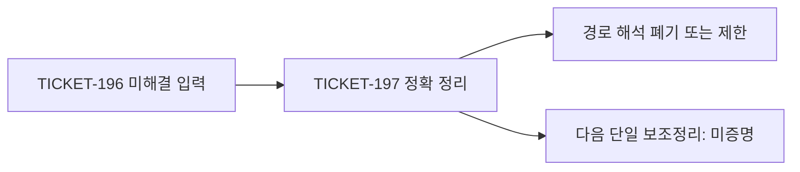

# TICKET-197: 첫 Xi 사각형, 콜라츠 연속 런, 희소 소수 거듭제곱 충돌

## 초록

TICKET-197은 리만 가설, 콜라츠 추측, 강한 골드바흐 추측, 쌍둥이 소수
추측을 동시에 공격한다. **네 문제 중 어느 것도 해결하지 않았다.** 이번
티켓은 더 좁은 네 명제를 증명하고 TICKET-196 뒤에 남은 세 가지 잘못된
기대를 제거한다.

1. 실제 Xi 함수의 첫 소진 사각형은 무영점이며 Taylor-Rouché 인증이
   존재하지만, 이 영역은 열린 임계띠를 전혀 만나지 않는다.
2. 두 스칼라 조건을 모두 통과하는 무한 콜라츠 family
   `1^k 2^(2k)`의 모든 순환 회전은 정확한 affine divisibility에서
   탈락한다.
3. 골드바흐 소수 거듭제곱 중복 보정은 밀도 0인 짝수 target 집합에만
   지지된다.
4. 차이가 2인 proper prime power 충돌의 지수는 같을 수 없으므로,
   쌍둥이 소수 중복 보정은 더 낮은 차수의 혼합 지수 항이다.

기계 판독 결과는
[`ticket197-first-rectangle-run-block-sparse-collision.json`](../data/open-problem/ticket197-first-rectangle-run-block-sparse-collision.json)에
있다. 네 상태는 모두 `open_not_proven`이고 해결 수는 0이다.

## 주장 원장

| 문제 | TICKET-197의 정확한 결과 | 폐기한 해석 | 남은 무한 단계 |
|---|---|---|---|
| 리만 | 실제 Xi의 `D_2` 사각형을 존재적으로 Rouché 폐쇄 | `D_2`가 비임계선 영점을 실질적으로 통제한다 | 임계띠에 들어가는 명시적 인증 사각형 |
| 콜라츠 | 모든 `k>=1`에서 `1^k2^(2k)`와 전 회전 배제 | 스칼라 허용성이 실제 순환 가능성을 뒷받침한다 | 여러 run을 가진 word의 균일 배제 |
| 골드바흐 | 충돌 지지 짝수의 자연밀도가 0 | 중복 보정만으로 모든 짝수에 여유가 생긴다 | 점별 이항 소수 상관 하한 |
| 쌍둥이 소수 | 동일 지수 충돌 배제와 낮은 차수의 충돌 질량 | 보정이 주도적인 제곱층을 없앤다 | 무한 블록의 parity-breaking 하한 |

아래 유한 표는 식과 구현을 검사한다. 전칭 명제나 무한성의 증명으로
승격하지 않는다.

## 1. 리만 가설

### 1.1 선언 명제

```text
Xi(z)=xi(1/2+iz)
```

로 두고 `S_n`을 원점 Taylor 절단이라 하자. 첫 닫힌 소진 사각형을

```text
D_2^+={z: |Re z|<=2, 1/2<=Im z<=2},
D_2^-=conjugate(D_2^+)
```

로 두면 `Xi`는 두 영역에서 무영점이다. 따라서 각 부호에 대해 어떤
`n`이 존재하여 `S_n`의 사각형 내부 영점 수가 0이고

```text
sup_boundary |Xi-S_n| < inf_boundary |S_n|
```

이다. 이것은 존재 정리다. 구체적인 `n`, 계수 interval, 수치 Rouché
margin은 주지 않는다.

### 1.2 증명

`z=x+iy`이면 `s=1/2+iz`에서

```text
Re s=1/2-y,   Im s=x.
```

따라서 위 사각형은 `-3/2<=Re s<=0`, 아래 사각형은
`1<=Re s<=5/2`로 간다. completed xi의 영점은 비자명 zeta 영점이며
`0<Re s<1`에 있고 `xi(0)=xi(1)=1/2`이다. 그러므로 두 compact image에는
영점이 없다.

한 닫힌 사각형에서 `delta=min|Xi|`라 하자. compact성과 무영점성으로
`delta>0`이다. entire 함수의 Taylor 절단은 compact 집합에서 균일
수렴하므로 어떤 `n`에 대해

```text
sup |Xi-S_n|<delta/3
```

이다. 따라서 `inf|S_n|>=2delta/3`이고 Rouché 정리로 `Xi`와 `S_n`의
영점 수가 모두 0임을 얻는다.

### 1.3 계산, no-go, 한계

생성기는 두 사각형의 좌표상을 유리수로 정확히 기록하고 열린 임계띠와
교집합이 없음을 검사한다. 표본 영점 탐색이 아니다.

- **확립:** `ActualXiFirstRectangleExistenceAndVacuityBoundary`.
- **폐기:** 첫 사각형 폐쇄를 비임계선 영점 통제의 증거로 보는 경로.
- **한계:** 명시적 절단 차수와 양의 interval margin이 없다.
- **다음 단일 보조정리:**
  `ExplicitXiTaylorDegreeAndRoucheMarginOnFirstCriticalStripEnteringRectangleD3`.

## 2. 콜라츠 추측

### 2.1 선언 명제

모든 `k>=1`에서 accelerated Collatz의 순환 valuation word

```text
w_k=1^k2^(2k)
```

를 생각하자. `h=3k`, `r=k`이므로 TICKET-196의 두 스칼라 gate

```text
32^k>27^k,
(125/108)^k>1
```

를 모두 통과한다. 그러나 `w_k`와 모든 순환 회전은 양의 순환에 필요한
affine divisibility를 만족하지 못한다.

### 2.2 affine 계산과 증명

valuation word를 `a_1,...,a_h`, 부분합을 `A_j=a_1+...+a_j`라 하자.
가속 반복은

```text
T^h(n)=(3^h n+B(a))/2^A_h,
B(a)=sum_{j=0}^{h-1}3^(h-1-j)2^A_j
```

이다. 순환이 있으려면

```text
D(a)=2^A_h-3^h>0,   D(a) divides B(a)
```

여야 한다. `w_k`에는 기하급수 합으로

```text
D_k=32^k-27^k,
B_k=32^k+27^k-2*18^k,
B_k-D_k=2*9^k(3^k-2^k)
```

를 얻는다. `D_k`는 홀수이고 3과 서로소이므로
`gcd(D_k,2*9^k)=1`이다. `D_k|B_k`라면 `D_k|(3^k-2^k)`여야 하지만

```text
0<3^k-2^k<32^k-27^k=D_k
```

이므로 모순이다.

첫 valuation이 `v_0`인 한 칸 순환 회전의 numerator를 `B'`라 하면

```text
2^v_0 B'=3B+D
```

이다. `D`가 홀수이므로 `D|B'`와 `D|B`는 동치다. 따라서 모든 회전이
배제된다.

### 2.3 계산, no-go, 한계

`k=1,...,64`에서 닫힌 식, 인수분해, 서로소성, 두 gate, 모든 순환 회전을
정확 정수로 검사한다. 유한 표는 회귀 검사이고 위 증명이 모든 `k`를
처리한다.

- **확립:** `ContiguousOneTwoRunAffineDivisibilityObstruction`.
- **폐기:** 생존하는 `1/3` count-profile이 가장 뭉친 word의 순환 가능성을
  뒷받침한다고 보는 경로.
- **한계:** 임의의 교대 run과 나머지 허용 밀도는 열려 있다. 비자명 순환을
  찾지 않았다.
- **다음 단일 보조정리:**
  `UniformAffineDivisibilityObstructionForFixedRunCountOneTwoWordsInTheAdmissibleDensityWindow`.

## 3. 강한 골드바흐 추측

### 3.1 선언 명제

`Q`를 홀수 proper prime power에 제한한 von Mangoldt 부분이라 하고

```text
C(X)={짝수 N<=X:(Q*Q)(N)>0}
```

로 두면 `|C(X)|=o(X)`이다. 따라서 TICKET-196의 정확한 중복 subtraction은
밀도 0인 짝수 target에서만 이전 union envelope를 바꾼다.

### 3.2 증명

`X` 이하 홀수 proper prime power의 수를 `A(X)`라 하자. 소수 제곱은
`pi(sqrt X)=O(sqrt X/log X)`개다. 지수 3 이상은 각 지수의 자명 상계를
`e<=log_2 X`까지 더하여 `O(X^(1/3)log X)`개다. 따라서

```text
A(X)=O(sqrt X/log X+X^(1/3)log X)
    =O(sqrt X/log X).
```

`C(X)`의 원소는 이 집합의 두 원소 합이다. 순서와 합 상한을 무시하면
경우의 수만 늘어나므로

```text
|C(X)|<=A(X)^2=O(X/log^2 X)=o(X).
```

양의 로그 가중치는 `(Q*Q)(N)`의 0 여부를 바꾸지 않으므로 같은 support
정리가 성립한다.

### 3.3 계산, no-go, 한계

생성기는 `X=2^8,...,2^24`에서 exact support를 열거하여 `A(X)`, 지지되는
짝수 수, 정확한 밀도, `A(X)^2` 상계를 기록한다. 첫 기록 witness는
`18=9+9`이다.

- **확립:** `GoldbachPrimePowerCollisionSupportHasDensityZero`.
- **폐기:** 중복 subtraction만으로 모든 짝수에 균일한 margin이 생긴다는
  경로.
- **한계:** 밀도 0 집합도 무한일 수 있고 두 stratum 모두 점별 소수-소수
  상관 하한이 없다.
- **다음 단일 보조정리:**
  `ExplicitGoldbachCorrelationMarginOnEveryLargeCollisionFreeEvenTarget`.

## 4. 쌍둥이 소수 추측

### 4.1 선언 명제

차이가 2인 두 홀수 proper prime power의 지수는 같을 수 없다. 특히
`q^2-p^2=2`인 제곱-제곱 충돌은 없다. 따라서 모든 `Q(n)Q(n+2)` 양의
항에는 지수 3 이상 endpoint가 있고, 그 가중 dyadic 질량은

```text
O(X^(1/3)log X)
```

이다. 이는 현재 주도적인 소수 제곱 오염 상계 `O(sqrt X log X)`보다
낮은 차수다.

### 4.2 증명

홀수 소수 `q>p`, `e>=2`에 대해 `q^e-p^e=2`라면

```text
(q-p)(q^(e-1)+q^(e-2)p+...+p^(e-1))=2.
```

첫 인자는 2 이상이고 둘째 인자는 1보다 크므로 모순이다. 따라서 충돌의
두 지수는 다르고 그중 하나는 3 이상이다.

각 충돌을 지수 3 이상 endpoint에 배정한다. 고정 endpoint는 거리 2인
이웃을 최대 두 개 가지므로 배정 다중도는 균일하게 유계다. `2X+2` 이하
지수 3 이상 prime power의 Chebyshev theta 질량은 `O(X^(1/3))`, 반대쪽
가중치는 `log(2X+2)` 이하이므로 전체는 `O(X^(1/3)log X)`다.

```text
X^(1/3)log X=o(sqrt X log X)
```

이므로 이 상계 수준에서 충돌 subtraction은 주도 제곱층 예산을 없앨 수
없다.

### 4.3 계산, no-go, 한계

`[2^4,2^5)`부터 `[2^24,2^25)`까지 모든 발견 충돌이 혼합 지수임을
검사한다. 계산은 `(25,27)=(5^2,3^3)`을 찾는다. 이것이 유일한 해라고
주장하지 않는다.

- **확립:** `TwinPrimeEqualExponentCollisionNoGoAndLowerOrderSaving`.
- **폐기:** 정확한 충돌 subtraction이 주도 prime-square 오염을 제거할
  것이라는 경로.
- **한계:** 혼합 지수 방정식을 분류하지 않았고 parity-breaking 소수쌍
  하한도 없다.
- **다음 단일 보조정리:**
  `ParityBreakingShiftTwoLowerBoundDominatesPrimeSquareLayerAndMixedExponentTailOnInfinitelyManyDyadicBlocks`.

## 5. 증명 DAG



JSON에는 각 문제별 네 노드 DAG가 있고 상태는 각각
`open_input_from_ticket196`, `proved_exact`, `refuted_or_route_limited`,
`open_not_proven`이다.

## 6. 재현 방법

```powershell
D:\python\anaconda3\python.exe scripts\ticket197_first_rectangle_run_block_sparse_collision.py
D:\python\anaconda3\python.exe -m unittest tests.test_ticket197_first_rectangle_run_block_sparse_collision
D:\python\anaconda3\python.exe scripts\verify_open_problem_structure.py
```

기대하는 핵심 값은 정확 정리 4개, 리만 좌표 행 2개, 콜라츠 exact scale
64개, 골드바흐 support scale 17개, 쌍둥이 소수 dyadic scale 21개, 추측
해결 0개, 실패 0개다.

## 7. 문헌 경계

- Clay의 RH 공식 설명: <https://www.claymath.org/wp-content/uploads/2022/05/riemann.pdf>
- Tao의 almost-all 콜라츠 정리: <https://arxiv.org/abs/1909.03562>
- 강한 골드바흐의 `4*10^18`까지 유한 검증:
  <https://doi.org/10.1090/S0025-5718-2013-02787-1>
- Maynard의 bounded prime gaps 원 논문:
  <https://doi.org/10.4007/annals.2015.181.1.7>

TICKET-197의 인수분해와 support 상계는 프로젝트 내부의 경로 교정으로만
제시한다. 최초성이나 학계 우선권을 주장하지 않는다.

## 결론

이번 진전은 중간 수준이다. 실질 RH 정보를 주지 않는 첫 Xi 영역, 매우
정렬된 무한 Collatz word family, 두 중복 보정의 점근적 역할을 닫았다.
리만 가설, 콜라츠 추측, 강한 골드바흐 추측, 쌍둥이 소수 추측 중 어느
것도 증명하거나 반증하지 않았다.
