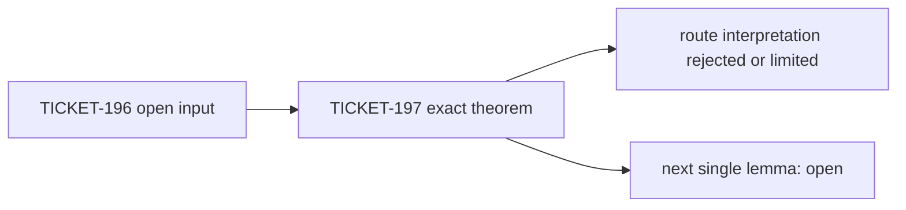

# TICKET-197: First Xi Rectangle, Collatz Run Blocks, and Sparse Prime-Power Collisions

## Abstract

TICKET-197 continues PrimeProject's simultaneous proof search for the Riemann
Hypothesis (RH), the Collatz conjecture, the strong Goldbach conjecture, and
the Twin Prime conjecture. It resolves none of them. It proves four narrower
statements and removes three misleading expectations left by TICKET-196:

1. the first actual-Xi exhaustion rectangles are zero-free and admit Taylor
   Rouché certificates existentially, but they avoid the open critical strip;
2. every cyclic rotation of the infinite Collatz family `1^k 2^(2k)` fails the
   exact affine divisibility condition despite passing both scalar gates;
3. the Goldbach prime-power overlap correction is supported on a density-zero
   set of even targets;
4. a gap-two proper-prime-power collision cannot have equal exponents, so the
   Twin Prime overlap correction is a lower-order mixed-exponent term.

The machine-readable result is
[`ticket197-first-rectangle-run-block-sparse-collision.json`](../data/open-problem/ticket197-first-rectangle-run-block-sparse-collision.json).
Every parent status remains `open_not_proven` and the resolution count is zero.

## Claim ledger

| Problem | Exact TICKET-197 result | Discarded interpretation | Missing infinite step |
|---|---|---|---|
| RH | existential Rouché closure of the actual-Xi `D_2` rectangles | `D_2` gives nontrivial control of off-critical zeros | explicit certified rectangle entering the critical strip |
| Collatz | all rotations of `1^k2^(2k)` are excluded for every `k>=1` | scalar admissibility makes clustered words plausible cycles | uniform obstruction for bounded or growing run complexity |
| Goldbach | collision-supported even targets have density zero | overlap subtraction alone supplies an every-even margin | pointwise binary correlation lower bound |
| Twin Prime | equal-exponent collision no-go and lower-order overlap mass | overlap subtraction cancels the leading square layer | parity-breaking shift-two lower bound on infinitely many blocks |

Finite tables validate formulas and expose witnesses. They are not used as
proofs of universal or infinitude statements.

## 1. Riemann Hypothesis

### 1.1 Declared proposition

Let

```text
Xi(z) = xi(1/2 + i z)
```

and let `S_n` be its Taylor sections at zero. For the closed first exhaustion
rectangles

```text
D_2^+ = {z: |Re z|<=2, 1/2<=Im z<=2},
D_2^- = conjugate(D_2^+),
```

`Xi` is zero-free. For each sign there therefore exists `n` such that `S_n`
has zero count zero in the rectangle and

```text
sup_boundary |Xi-S_n| < inf_boundary |S_n|.
```

This is an existential theorem. It does not exhibit `n`, interval coefficient
enclosures, or a numerical Rouché margin.

### 1.2 Proof

Write `z=x+iy`. Under `s=1/2+iz`,

```text
Re s = 1/2-y,   Im s = x.
```

Thus the upper rectangle maps into `-3/2<=Re s<=0`, and the lower rectangle
maps into `1<=Re s<=5/2`. Zeros of the completed xi function correspond to
nontrivial zeta zeros and lie in `0<Re s<1`; moreover `xi(0)=xi(1)=1/2`.
Hence neither compact image contains a xi zero.

Let `delta=min |Xi|` on one closed rectangle. Compactness and zero-freeness
give `delta>0`. Taylor sections of an entire function converge uniformly on
compact sets, so for some `n`,

```text
sup |Xi-S_n| < delta/3.
```

Then `inf |S_n|>=2delta/3`. Rouché's theorem gives equal zero counts for `Xi`
and `S_n`, namely zero, and the strict boundary inequality follows.

### 1.3 Reproducible calculation and limit

The generator records the exact coordinate images of both rectangles and
checks that their intersection with the open critical strip is empty. This is
symbolic rational arithmetic, not a sampled zero search.

- **Established:** `ActualXiFirstRectangleExistenceAndVacuityBoundary`.
- **Discarded:** treating the first rectangle as evidence about an off-critical
  zero. The region is outside the only strip where a nontrivial zeta zero can
  occur.
- **Limit:** no explicit section degree or certified positive margin is
  produced.
- **Next single lemma:**
  `ExplicitXiTaylorDegreeAndRoucheMarginOnFirstCriticalStripEnteringRectangleD3`.

## 2. Collatz Conjecture

### 2.1 Declared proposition

For every `k>=1`, consider the cyclic accelerated-Collatz valuation word

```text
w_k = 1^k 2^(2k).
```

It has horizon `h=3k` and one-count `r=k`, so it passes both TICKET-196 scalar
gates:

```text
32^k > 27^k,
(125/108)^k > 1.
```

Nevertheless, neither `w_k` nor any cyclic rotation satisfies the affine
divisibility condition required by a positive cycle.

### 2.2 Affine calculation

For a valuation word `a_1,...,a_h`, put `A_j=a_1+...+a_j`. The accelerated
iterate has the form

```text
T^h(n) = (3^h n + B(a))/2^A_h,
B(a) = sum_{j=0}^{h-1} 3^(h-1-j) 2^A_j.
```

A cycle therefore requires

```text
D(a)=2^A_h-3^h > 0,   D(a) divides B(a).
```

For `w_k=1^k2^(2k)`, direct geometric summation gives

```text
D_k = 32^k-27^k,
B_k = 32^k+27^k-2*18^k,
B_k-D_k = 2*9^k(3^k-2^k).
```

Now `D_k` is odd and is coprime to `3`, hence
`gcd(D_k,2*9^k)=1`. If `D_k` divided `B_k`, it would divide
`3^k-2^k`. But

```text
0 < 3^k-2^k < 32^k-27^k = D_k,
```

a contradiction.

If `B'` denotes the numerator after one cyclic rotation beginning with
valuation `v_0`, the affine identity gives

```text
2^v_0 B' = 3B + D.
```

Since `D` is odd, `D|B'` holds exactly when `D|B`. Thus all rotations are
excluded.

### 2.3 Reproducible calculation and limit

Exact integer rows for `k=1,...,64` check the closed form, factorization,
coprimality, scalar gates, and all cyclic rotations. The finite table is a
regression test; the proof above handles every `k`.

- **Established:** `ContiguousOneTwoRunAffineDivisibilityObstruction`.
- **Discarded:** using the surviving one-third count profile as evidence that
  its maximally clustered order can realize a cycle.
- **Limit:** arbitrary alternating run patterns and other admissible densities
  remain open. No nontrivial Collatz cycle is found.
- **Next single lemma:**
  `UniformAffineDivisibilityObstructionForFixedRunCountOneTwoWordsInTheAdmissibleDensityWindow`.

## 3. Strong Goldbach Conjecture

### 3.1 Declared proposition

Let `Q` be the odd proper-prime-power part of the von Mangoldt function and
define

```text
C(X) = {even N<=X : (Q*Q)(N)>0}.
```

Then `|C(X)|=o(X)`. Therefore the exact TICKET-196 overlap subtraction changes
the older union envelope only on a density-zero set of even targets.

### 3.2 Proof

Let `A(X)` count odd proper prime powers at most `X`. Prime squares contribute
`pi(sqrt X)=O(sqrt X/log X)`. For exponents at least three, summing the crude
bound `O(X^(1/e))` over `e<=log_2 X` gives

```text
O(X^(1/3) log X).
```

Consequently

```text
A(X)=O(sqrt X/log X + X^(1/3)log X)
    =O(sqrt X/log X).
```

Every target in `C(X)` is a sum of two members of this set. Ignoring order and
the sum cutoff only enlarges the count, so

```text
|C(X)| <= A(X)^2 = O(X/log^2 X) = o(X).
```

The same proof applies to the weighted support because positive logarithmic
weights do not change whether `(Q*Q)(N)` vanishes.

### 3.3 Reproducible calculation and limit

The generator enumerates exact support through `X=2^24`, records `A(X)`, the
number of supported even targets, exact support density, and the bound
`|C(X)|<=A(X)^2`. The smallest recorded witness is `18=9+9`.

- **Established:** `GoldbachPrimePowerCollisionSupportHasDensityZero`.
- **Discarded:** expecting overlap subtraction by itself to provide a uniform
  margin for every even target.
- **Limit:** a density-zero set may be infinite, and neither stratum receives
  the missing pointwise prime-prime correlation lower bound.
- **Next single lemma:**
  `ExplicitGoldbachCorrelationMarginOnEveryLargeCollisionFreeEvenTarget`.

## 4. Twin Prime Conjecture

### 4.1 Declared proposition

If odd proper prime powers differ by two, their exponents cannot be equal. In
particular, there is no square-square collision `q^2-p^2=2`. Every positive
term in `Q(n)Q(n+2)` therefore touches an exponent-at-least-three layer. Its
weighted dyadic mass is

```text
O(X^(1/3) log X),
```

which is lower order than the available leading square-layer contamination
bound `O(sqrt X log X)`.

### 4.2 Proof

If `q^e-p^e=2` for odd primes `q>p` and `e>=2`, then

```text
(q-p)(q^(e-1)+q^(e-2)p+...+p^(e-1)) = 2.
```

The first factor is at least two and the second is greater than one, a
contradiction. Thus the two exponents in any collision are unequal and one is
at least three.

Charge each collision to an endpoint with exponent at least three. A fixed
endpoint has at most two distance-two neighbours, so the charging
multiplicity is bounded. The Chebyshev theta mass of exponent-at-least-three
prime powers up to `2X+2` is `O(X^(1/3))`; the weight at the other endpoint is
at most `log(2X+2)`. This proves the weighted bound.

Since

```text
X^(1/3)log X = o(sqrt X log X),
```

the collision subtraction cannot, at the level of these upper bounds, cancel
the leading square-layer budget.

### 4.3 Reproducible calculation and limit

Dyadic blocks from `[2^4,2^5)` through `[2^24,2^25)` verify that every found
collision is mixed-exponent. The run finds `(25,27)=(5^2,3^3)`. This finite
observation is not a classification of all exponential Diophantine solutions.

- **Established:** `TwinPrimeEqualExponentCollisionNoGoAndLowerOrderSaving`.
- **Discarded:** expecting exact overlap subtraction to remove the leading
  prime-square contamination.
- **Limit:** mixed-exponent collisions are not classified and no
  parity-breaking prime-pair lower bound is proved.
- **Next single lemma:**
  `ParityBreakingShiftTwoLowerBoundDominatesPrimeSquareLayerAndMixedExponentTailOnInfinitelyManyDyadicBlocks`.

## 5. Proof DAG



The JSON stores a separate four-node DAG for each problem with statuses
`open_input_from_ticket196`, `proved_exact`, `refuted_or_route_limited`, and
`open_not_proven`.

## 6. Reproduction

```powershell
D:\python\anaconda3\python.exe scripts\ticket197_first_rectangle_run_block_sparse_collision.py
D:\python\anaconda3\python.exe -m unittest tests.test_ticket197_first_rectangle_run_block_sparse_collision
D:\python\anaconda3\python.exe scripts\verify_open_problem_structure.py
```

Expected machine summary:

```text
exact_theorem_count: 4
riemann_exact_coordinate_row_count: 2
collatz_exact_scale_row_count: 64
goldbach_finite_support_row_count: 17
twin_finite_dyadic_row_count: 21
conjecture_resolution_count: 0
total_failure_count: 0
```

## 7. Literature boundary

- RH remains the all-critical-line assertion in the official Clay problem
  description: <https://www.claymath.org/wp-content/uploads/2022/05/riemann.pdf>.
- Tao's almost-all Collatz theorem is substantially stronger than naive random
  drift but is not an all-orbit theorem: <https://arxiv.org/abs/1909.03562>.
- Strong Goldbach has been computationally verified through `4*10^18`, which
  is finite evidence rather than a universal proof:
  <https://doi.org/10.1090/S0025-5718-2013-02787-1>.
- Bounded prime gaps do not isolate exact gap two; Maynard's primary result is
  <https://doi.org/10.4007/annals.2015.181.1.7>.

The elementary factorizations and support estimates in TICKET-197 are stated
as project-local route corrections. No priority or novelty claim is made.

## Conclusion

TICKET-197 makes measurable progress only at the intermediate level. It
closes a vacuous first Xi region, an infinite but highly ordered Collatz word
family, and the asymptotic role of two exact overlap corrections. It does not
prove or disprove RH, Collatz, strong Goldbach, or Twin Prime.
