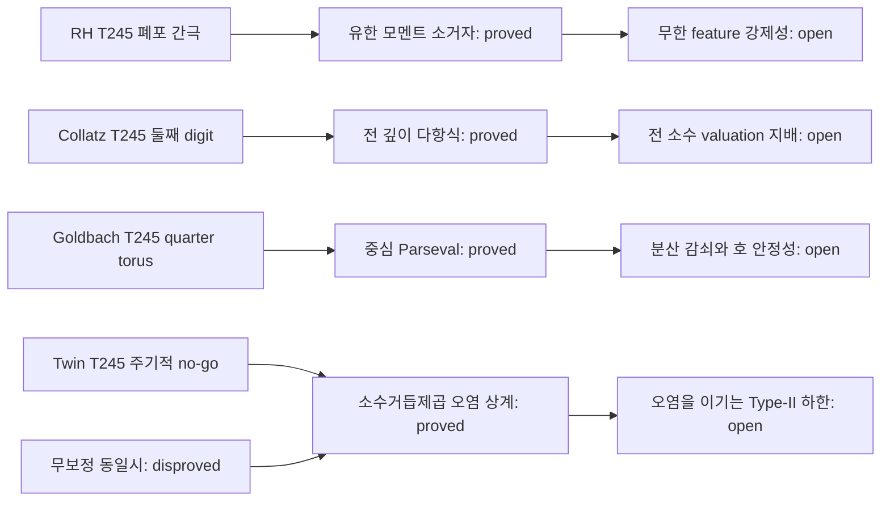

# TICKET-246: 유한 모멘트 소거자, 전 깊이 Fermat 다항식, 유리 중심 Parseval, 소수거듭제곱 오염

## 상태 선언

- `iteration_complete`: true
- `resolved_count`: 0
- `candidate_resolution_count`: 0
- `new_partial_theorem_count`: 3
- `exact_no_go_count`: 1
- `stagnated_problem_count`: 0
- 집중 문제: Collatz
- 부모: TICKET-245
- 프로그램 상태: `open_not_proven`

이번 회차는 프로젝트 내부의 보조명제 네 개를 증명했다. 리만 가설,
콜라츠 추측, 강한 골드바흐 추측, 쌍둥이 소수 추측 중 어느 것도
증명하거나 반증하지 않았다. 기계 판독 원장은
`data/open-problem/ticket246-moment-alldepth-parseval-primepower.json`이다.

## 재현 계약

```powershell
python scripts/ticket246_moment_alldepth_parseval_primepower.py
python -m unittest tests.test_ticket246_moment_alldepth_parseval_primepower -v
python scripts/verify_ticket246_structure.py
python scripts/verify_open_problem_structure.py
node --check assets/ticket246-open-problem.js
node --check assets/open-problems.js
node scripts/verify_pages.cjs
```

정리를 지지하는 계산은 정수 또는 정확한 `Fraction`만 쓴다. JSON의
부동소수 표시값은 증명에 쓰지 않는다. 모든 열거는 결정적이므로 난수
시드는 없다.

| 문제 | 새 결과 | 분류 | 상태 |
|---|---|---|---|
| 리만 가설 | 고정된 유한 개 짝수 모멘트를 모두 소거하는 정규화 유한지지 함수의 명시적 구성 | `exact_no_go` | `open_not_proven` |
| 콜라츠 | 고정 밑 `32/27` 차의 모든 `q`진 깊이를 결정하는 유한 다항식 항등식 | `partial_theorem` | `open_not_proven` |
| 강한 골드바흐 | 유리 중심 소수 지수합 잔차의 정확한 residue-discrepancy Parseval 등식 | `partial_theorem` | `open_not_proven` |
| 쌍둥이 소수 | 소수거듭제곱 쌍 프록시와 홀수 쌍둥이 소수 계수의 오염 상계 | `partial_theorem` | `open_not_proven` |

## 1. 리만 가설

### A. 정확한 명제: `FiniteEvenMomentAnnihilatorNoGo`

모든 정수 `m>=1`에 대하여

```text
e_j = 2^(-1/2) 1_([-j-1,-j] union [j,j+1]),  0<=j<=2m,
c_j = (-1)^j binom(2m,j),
g_m = sum_(j=0)^(2m) c_j e_j
```

로 둔다. 그러면 `g_m`은 영이 아니고 실수값 짝함수이며 유한 지지를
갖고,

```text
integral_R x^(2k)g_m(x)dx=0  (0<=k<m),
||g_m||_2^2=binom(4m,2m)
```

이다. 따라서 `f_m=g_m/sqrt(binomial(4m,2m))`은 단위 노름이고

```text
Q_m(f_m)=sum_(0<=k<m)|integral x^(2k)f_m(x)dx|^2=0.   (RH-246)
```

즉 이 함수들을 포함하는 정규화 모형 클래스 전체를 처음 `m`개 짝수
모멘트만으로 영점집합과 엄격히 분리할 수 없다.

### B-D. 정의와 증명

껍질 지시함수들은 영측도 끝점을 제외하면 지지가 서로 겹치지 않고
단위 노름이므로 정규직교한다. 공통 제곱근 인자를 제외한 `e_j`의
`2k`차 모멘트는

```text
((j+1)^(2k+1)-j^(2k+1))/(2k+1)
```

이며 `j`에 관한 차수 `2k`의 다항식이다. `k<m`이면 차수가 `2m`보다
작으므로 `2m`차 교대 이항합이 이를 소거한다. 정규직교성과
Vandermonde 항등식으로

```text
sum_j c_j^2=sum_j binom(2m,j)^2=binom(4m,2m)>0
```

를 얻는다. 그러므로 정규화가 가능하고 영 모멘트들은 유지된다.

### E-G. 정확 계산과 no-go 인증서

생성기는 `m=1,2,3,4,5,6,8,10,12`를 정확한 정수·유리수로 검사한다.
모든 모멘트 합과 중앙 이항계수 노름을 독립적으로 비교해 9개 행,
실패 0개를 얻었다. `m=12`의 노름 제곱은
`32,247,603,683,100`이다. 고정된 목록에서 계산량은
`O(sum m^2)`이다. transcript SHA-256은

```text
b69bddb4b9317df798192eb20375e83c87132c4804c1cdb57fe71723a8667765
```

이다.

### H-K. 한계, 경로 판정, 다음 보조정리

이 계단함수들은 실수 짝 `L2` 모형이지 실제의 매끄러운 Guinand-Weil
허용 함수 클래스가 아니다. 그 클래스에의 매입이나 진짜 Weil
함수와의 동일시는 증명하지 않았다. 모든 `m`에 대한 결론은 유한차분
증명에서 나오며 9개 계산의 외삽이 아니다.

- 결과: `exact_no_go`
- 폐기한 경로: 이 소거자들을 포함하는 클래스에서 고정된 유한 개
  짝수 모멘트만으로 영점 없는 폐포 분리를 얻는 경로
- 남은 최소 간극: 실제 정규화 허용 폐포에서 전체 Weil 함수를
  제어하는 무한 정보 강제성
- 다음 단일 보조정리:
  `InfiniteFeatureCoercivityOnNormalizedAdmissibleWeilClosure`

## 2. 콜라츠 추측 — 집중 문제

### A. 정확한 명제: `AllDepthFixedBaseFermatPolynomialIdentity`

모든 소수 `q>5`에 대해 정확한 정수

```text
U=(2^(q-1)-1)/q,  V=(3^(q-1)-1)/q
```

와

```text
P_q = 5U-3V
    + q(10U^2-3V^2)
    + q^2(10U^3-V^3)
    + 5q^3U^4+q^4U^5
```

를 정의하면

```text
32^(q-1)-27^(q-1)=qP_q,
 2^(q-1)- 3^(q-1)=q(U-V)                         (CO-246)
```

가 정수 항등식으로 성립한다. 따라서 모든 `r>=1`에 대해 첫 차가
`q^(r+1)`로 나누어지는 것은 `P_q=0 mod q^r`와 동치이고, 둘째 차의
경우는 `U-V=0 mod q^r`와 동치다.

### B-D. 증명과 이전 digit 간극의 폐쇄

Fermat 소정리로 `U,V`가 정수이고

```text
32^(q-1)=(1+qU)^5,  27^(q-1)=(1+qV)^3
```

이다. 두 유한 이항식을 완전히 전개해 빼고 `q`를 묶으면 표시된
5차 다항식을 정확히 얻는다. 생략된 `q`진 꼬리는 없다. 둘째 등식은
직접 뺀 것이다. 이로써 TICKET-245의 둘째 digit 공식은 주어진 소수에
대해 임의 깊이까지 확장된다.

### E-G. 적대적 재생

`5<q<=200,000`의 소수 `17,981`개 전부에서 몫 다섯 자리를 모듈러
거듭제곱과 다항식으로 교차 검사했고 실패는 0개다. 이 유한 범위에서

```text
v_q(32^(q-1)-27^(q-1))=1: 17,981개,
v_q( 2^(q-1)- 3^(q-1))=1: 17,980개, =2: q=23 한 개
```

였다. 체는 `O(B log log B)` 시간과 `O(B)` 바이트, 각 재생은 고정
다섯 자리에서 `O(log q)` 모듈러 곱셈을 쓴다. 모든 산술은 정확한
정수이다. transcript SHA-256은

```text
7c570287e63987c481e1b978c549ff1889b3dcc058ef859fe5c1befb32456269
```

이다.

### H-K. 한계, 판정, 다음 보조정리

항등식 자체는 모든 깊이에 정확하지만 두 valuation을 모든 소수에서
비교하지 않는다. 유한 histogram은 그런 전칭명제를 증명하지 않는다.
그 비교마저도 국소 고정-밑 장애만 다루며 임의 콜라츠 궤도, 발산,
비자명 주기를 해결하지 않는다.

- 결과: `partial_theorem`
- 새로 폐기한 경로: 없음. 유한 범위의 bad prime 부재를 승격하지 않음
- 남은 최소 간극: `P_q`와 `U-V` valuation의 전 소수 균일 지배
- 다음 단일 보조정리:
  `FixedBaseAllPrimeValuationDominationForPqByUqMinusVq`

## 3. 강한 골드바흐 추측

### A. 정확한 명제: `RationalCenterResidueParsevalBridge`

`q>=3`, `X>=3`을 고정한다. 단원 잉여류 `r mod q`에서 `p<=X`인 홀수
소수의 개수를 `n_r`, `P=sum_r n_r`,
`delta_r=n_r-P/phi(q)`라 하자. 그러면

```text
S*(a)=sum_(p<=X, p odd, gcd(p,q)=1) exp(2 pi i ap/q),
R(a)=sum_(r unit mod q) delta_r exp(2 pi i ar/q)
```

에 대하여

```text
S*(a)=(P/phi(q))c_q(a)+R(a),
sum_(a mod q)|R(a)|^2=q sum_r delta_r^2,           (GB-246.1)
|R(a)|^2<=phi(q) sum_r delta_r^2.                 (GB-246.2)
```

이다. `(a,q)=1`이면 `c_q(a)=mu(q)`이고, `q`를 나누는 홀수 소수는 전체
소수합에 명시적인 유한 보정 `D_q(a)`를 더한다.

### B-D. 증명

소수합을 단원 잉여류별로 묶고 `n_r`를 평균과 편차로 나누면 평균항은
Ramanujan 합이다. 제곱을 전개하고

```text
sum_(a mod q) exp(2 pi i a(r-s)/q)=q 1_(r=s)
```

를 쓰면 Parseval 등식이 나온다. 점별 상계는 Cauchy-Schwarz이다.
이는 TICKET-245의 유리 중심 궤도 축약을 계산 가능한 소수 잉여류
분산에 연결하는 유한 정확 항등식이다.

### E-G. 정확 열거

`X=10,000,100,000,500,000` 각각에 대해 모든 `q=3,...,64`를 소수
체와 정확한 원분 계수 묶음으로 검사했다. 선택 행 27개, 실패 0개다.
최대 상대 분산은

```text
X= 10,000: 6497/501843, q=61,
X=100,000: 27179/22992025, q=53,
X=500,000: 37003/215654912, q=61
```

이다. 계산량은 체 `O(X log log X)`와 약 `62*pi(X)`개의 잉여류
배정이다. transcript SHA-256은

```text
36eb596f31cf8cc962d8f1bb069323d36d8e8478dd095922c64ad5a529a67e10
```

이다.

### H-K. 한계, no-go, 다음 보조정리

자료는 `X` 또는 `q`가 자랄 때의 감쇠를 증명하지 않는다. 중심
등식만으로 호 근방 안정성, minor-arc 절약, 양의 이항 Goldbach
하한을 얻지 못한다. 특히 `R(a)=0`이 아니면 Ramanujan 평균항만으로
원래 유리 중심 합을 대체할 수 없다.

- 결과: `partial_theorem`
- 폐기한 경로: residue-discrepancy 잔차를 버리고 모든 유리 중심
  소수합을 Ramanujan 평균으로만 치환
- 남은 최소 간극: 증가하는 분모에 대한 잉여류 분산 감쇠와 중심
  밖의 호 안정성
- 다음 단일 보조정리:
  `UniformQuarterTorusResidueVarianceDecayWithArcStability`

## 4. 쌍둥이 소수 추측

### A. 정확한 명제: `PrimePowerPairProxyContaminationBound`

홀수 `n>=3`에서 `PP(n)=1`을 `n=p^k` (`p` 소수, `k>=1`)일 때로
정의하고

```text
A_2(X)=sum_(3<=n<=X, n odd) PP(n)PP(n+2),
pi_2(X)=#{홀수 소수 p<=X : p+2도 소수}
```

라 하자. `Y=X+2`, `K=floor(log_2Y)`이면

```text
0<=A_2(X)-pi_2(X)<=B(Y)=2(K-1)floor(sqrt(Y)).       (TP-246)
```

따라서 어떤 `X` 수열에서 `A_2(X)-B(X+2)`가 무한히 커진다는 더 강한
명제는 쌍둥이 소수가 무한함을 함의한다.

### B-D. 증명

모든 쌍둥이 소수 시작점은 `A_2`에 들어간다. 거짓 프록시 쌍에는 왼쪽
또는 오른쪽에 합성 소수거듭제곱이 있다. `Y` 이하 합성 소수거듭제곱의
수는

```text
sum_(k=2)^K floor(Y^(1/k)) <= (K-1)floor(sqrt(Y))
```

이하이다. 두 위치에 합집합 상계를 적용하면 `B(Y)`를 얻는다.

### E-G. 반례 탐색과 정확 계수

보정하지 않은 `A_2=pi_2` 경로는 거짓이다. 명제의 홀수 영역에서 최소
거짓 쌍은 `(7,9)`이며 `9=3^2`이다. 정확한 체와 소수거듭제곱 표시로
`X=100,1,000,10,000,100,000,1,000,000,5,000,000`을 검사했다. 마지막
척도에서

```text
A_2=32,585, pi_2=32,463, 오염=122,
X+2 이하 합성 소수거듭제곱=427, B(X+2)=93,912
```

이다. 시간은 `O(Y log log Y)`, 메모리는 `O(Y)`이고 6개 행 모두
성공했다. transcript SHA-256은

```text
9b1df6145208e9fe91b48bca1b3a3f09be2de3bec22beaff05c0bd40ae0ecb1a
```

이다.

### H-K. 적대적 경계 교정, 한계, 다음 보조정리

첫 구현은 영역을 `n>=2`라고 썼고, 적대적 재생이 더 작은 거짓 프록시
`(2,4)`를 발견했다. 의도한 홀수 소수 상관과 맞도록 명제·열거·테스트를
홀수 `n>=3`으로 교정했다. 이는 영역 오류의 수정이지 추측의 증거가
아니다.

상계는 실제 오염보다 매우 큰 조악한 상계다. Type-II 하한이 아니며
`A_2-B -> infinity`는 쌍둥이 소수 무한성보다 강한 충분조건이다. 유한
계수는 점근식을 증명하지 않는다.

- 결과: `partial_theorem`
- 폐기한 경로: 소수거듭제곱 쌍 프록시와 쌍둥이 소수 계수의 무보정
  동일시
- 남은 최소 간극: 명시적 소수거듭제곱 오염을 이기는 무한 척도 국소
  하한
- 다음 단일 보조정리:
  `ScaleLocalTypeIILowerBoundBeyondPrimePowerContamination`

## Proof DAG



네 기계 DAG는 모두 비순환이고 허용된 상태 어휘만 사용하며 열린
전선이 정확히 하나씩이다. 서로 다른 추측 사이에 정리를 옮기는
간선은 없다.

## 전역 감사 결론

TICKET-246에서 네 보조정리, 폐기 경로, 유한 인증서는 완료됐다. 네 원
추측은 모두 `open_not_proven`이며 승격할 해결 후보가 없다.
