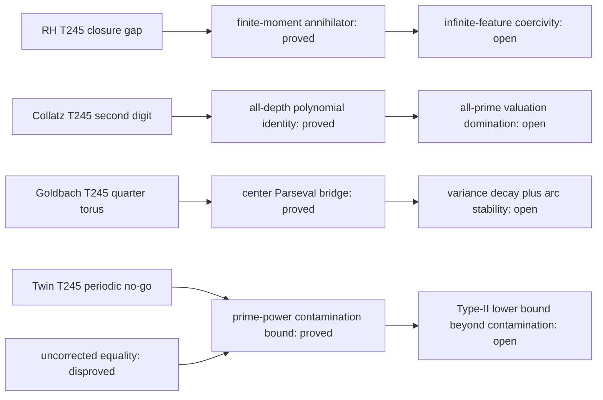

# TICKET-246: finite-moment annihilators, all-depth Fermat polynomials, rational-center Parseval, and prime-power contamination

## Status declaration

- `iteration_complete`: true
- `resolved_count`: 0
- `candidate_resolution_count`: 0
- `new_partial_theorem_count`: 3
- `exact_no_go_count`: 1
- `stagnated_problem_count`: 0
- deep focus: Collatz
- parent: TICKET-245
- program status: `open_not_proven`

This iteration proves four project-local auxiliary statements. It proves or
disproves none of the Riemann hypothesis, the Collatz conjecture, strong
Goldbach, and the twin-prime conjecture. The machine record is
`data/open-problem/ticket246-moment-alldepth-parseval-primepower.json`.

## Reproduction contract

```powershell
python scripts/ticket246_moment_alldepth_parseval_primepower.py
python -m unittest tests.test_ticket246_moment_alldepth_parseval_primepower -v
python scripts/verify_ticket246_structure.py
python scripts/verify_open_problem_structure.py
node --check assets/ticket246-open-problem.js
node --check assets/open-problems.js
node scripts/verify_pages.cjs
```

All theorem-bearing calculations use integers or exact `Fraction` values.
Floating companions in JSON are display-only. There is no random seed: all
enumerations are deterministic.

| Problem | new result | classification | status |
|---|---|---|---|
| Riemann | every fixed finite list of even moments has an explicit normalized compact-support annihilator in the model class | `exact_no_go` | `open_not_proven` |
| Collatz | one finite polynomial gives the exact `q`-adic depth of the fixed-base `32/27` difference at every depth | `partial_theorem` | `open_not_proven` |
| Strong Goldbach | the rational-center prime-sum residual has an exact residue-discrepancy Parseval norm | `partial_theorem` | `open_not_proven` |
| Twin Prime | the prime-power pair proxy differs from the odd twin count by an explicitly bounded composite-prime-power contamination | `partial_theorem` | `open_not_proven` |

## 1. Riemann hypothesis

### A. Exact proposition: `FiniteEvenMomentAnnihilatorNoGo`

For every integer `m>=1`, put

```text
e_j = 2^(-1/2) 1_([-j-1,-j] union [j,j+1]),  0<=j<=2m,
c_j = (-1)^j binom(2m,j),
g_m = sum_(j=0)^(2m) c_j e_j.
```

Then `g_m` is nonzero, real-even, and compactly supported, and

```text
integral_R x^(2k) g_m(x) dx = 0,                 0<=k<m,
||g_m||_2^2 = binom(4m,2m).
```

Consequently `f_m=g_m/sqrt(binomial(4m,2m))` has unit norm and

```text
Q_m(f_m)=sum_(0<=k<m) |integral x^(2k)f_m(x)dx|^2=0.   (RH-246)
```

Thus no nonnegative certificate using only these `m` moments can strictly
separate every normalized member of any class containing `f_m` from its zero
set.

### B-D. Definitions and proof

The shell indicators have disjoint supports up to null endpoints and unit
norm, hence are orthonormal. Apart from the common square-root factor, the
`2k`-th moment of `e_j` is

```text
((j+1)^(2k+1)-j^(2k+1))/(2k+1),
```

a polynomial in `j` of degree `2k`. For `k<m`, this degree is below `2m`.
The alternating binomial sum of order `2m` annihilates every polynomial of
degree below `2m`, giving every moment identity. Orthogonality and
Vandermonde's identity give

```text
sum_j c_j^2=sum_j binom(2m,j)^2=binom(4m,2m)>0.
```

Normalization is therefore valid and preserves all zero moments.

### E-G. Exact replay and no-go certificate

The generator checks `m=1,2,3,4,5,6,8,10,12`. It evaluates every moment sum
with exact integers/rationals and independently compares the coefficient norm
with the central binomial coefficient. There are nine successful rows and no
failures. At `m=12`, the norm square is `32,247,603,683,100`. The work is
`O(sum m^2)` integer operations for this fixed list. Transcript SHA-256:

```text
b69bddb4b9317df798192eb20375e83c87132c4804c1cdb57fe71723a8667765
```

### H-K. Limitation, route decision, and next lemma

The step functions are a real-even `L2` model family, not the actual smooth
Guinand-Weil admissible class. No embedding into that class and no identity
with the genuine Weil functional is proved. The finite replay is illustrative;
the all-`m` statement follows from finite differences, not extrapolation.

- result: `exact_no_go`
- retired route: zero-free closure separation based only on any fixed finite
  list of even moments on a class containing these annihilators
- remaining gap: coercive separation for the genuine normalized admissible
  closure using enough information to control the full Weil functional
- next single lemma:
  `InfiniteFeatureCoercivityOnNormalizedAdmissibleWeilClosure`

## 2. Collatz conjecture — deep focus

### A. Exact proposition: `AllDepthFixedBaseFermatPolynomialIdentity`

For every prime `q>5`, define the exact integers

```text
U=(2^(q-1)-1)/q,  V=(3^(q-1)-1)/q
```

and

```text
P_q = 5U-3V
    + q(10U^2-3V^2)
    + q^2(10U^3-V^3)
    + 5q^3 U^4
    + q^4 U^5.
```

Then, as exact integer identities,

```text
32^(q-1)-27^(q-1)=q P_q,
 2^(q-1)- 3^(q-1)=q(U-V).                         (CO-246)
```

For every integer `r>=1`, therefore,

```text
q^(r+1) divides 32^(q-1)-27^(q-1)  iff  P_q=0 mod q^r,
q^(r+1) divides  2^(q-1)- 3^(q-1)  iff  U-V=0 mod q^r.
```

Equivalently, each nonzero difference has valuation `1+v_q(P_q)` or
`1+v_q(U-V)` respectively.

### B-D. Proof and why it closes the prior digit gap

Fermat's theorem makes `U,V` integral. Substitution gives

```text
32^(q-1)=(1+qU)^5,  27^(q-1)=(1+qV)^3.
```

Expanding both binomials and subtracting gives exactly the displayed
degree-five polynomial after one factor of `q` is removed. There is no
discarded `q`-adic tail: the binomials terminate. Direct subtraction gives
the second identity. Divisibility equivalences follow from equality in the
integers. This advances TICKET-245's second-digit congruence to arbitrary
depth for a supplied prime.

### E-G. Adversarial replay

Every one of the `17,981` primes `5<q<=200,000` is sieved. Five quotient
digits are replayed with modular powers and compared with the polynomial
criteria. There are no identity failures. Within this finite interval:

```text
v_q(32^(q-1)-27^(q-1)) = 1 for all 17,981 primes,
v_q( 2^(q-1)- 3^(q-1)) = 1 for 17,980 primes and 2 for q=23.
```

The sieve uses `O(B log log B)` time and `O(B)` bytes; each modular replay
uses `O(log q)` multiplications at a fixed precision of five digits. All
checks use exact integers. Transcript SHA-256:

```text
7c570287e63987c481e1b978c549ff1889b3dcc058ef859fe5c1befb32456269
```

### H-K. Limitation, decision, and next lemma

The algebraic identity is all-depth, but it does not compare the two
valuations uniformly over all primes. The finite histogram cannot prove such
an all-prime comparison. Even that comparison would address only this local
fixed-base obstruction, not arbitrary Collatz trajectories, divergence, or
nontrivial cycles.

- result: `partial_theorem`
- newly retired route: none; the bounded absence of a bad prime is not an
  all-prime no-go or theorem
- remaining gap: prove uniform valuation domination between the exact
  polynomial `P_q` and `U-V`
- next single lemma:
  `FixedBaseAllPrimeValuationDominationForPqByUqMinusVq`

## 3. Strong Goldbach conjecture

### A. Exact proposition: `RationalCenterResidueParsevalBridge`

Fix `q>=3` and `X>=3`. For each unit residue `r mod q`, let `n_r` count odd
primes `p<=X` with `p=r mod q`, put `P=sum_r n_r`, and

```text
delta_r=n_r-P/phi(q).
```

For `a mod q`, define

```text
S*(a)=sum_(p<=X, p odd, gcd(p,q)=1) exp(2 pi i a p/q),
R(a)=sum_(r in units mod q) delta_r exp(2 pi i a r/q).
```

Then

```text
S*(a)=(P/phi(q)) c_q(a)+R(a),
sum_(a mod q) |R(a)|^2=q sum_(r in units mod q) delta_r^2,  (GB-246.1)
|R(a)|^2<=phi(q) sum_r delta_r^2.                       (GB-246.2)
```

When `gcd(a,q)=1`, `c_q(a)=mu(q)`. Odd primes dividing `q` are omitted from
`S*` and form a separate explicit finite correction `D_q(a)` in the complete
prime sum.

### B-D. Proof

Group the prime sum by unit residue classes and split each `n_r` into its mean
and discrepancy. The mean term is the Ramanujan sum. For Parseval, expand the
square and use character orthogonality

```text
sum_(a mod q) exp(2 pi i a(r-s)/q)=q 1_(r=s).
```

The pointwise estimate follows from Cauchy-Schwarz. These are finite exact
identities; they connect TICKET-245's rational-center orbit reduction to a
computable prime-residue variance.

### E-G. Exact enumeration

The generator sieves primes and exhausts every `q=3,...,64` for each
`X=10,000`, `100,000`, and `500,000`. It verifies the decomposition and
Parseval equality with exact cyclotomic coefficient grouping, records 27
selected rows, and has zero failures. The maximum exact relative variances are

```text
X= 10,000: 6497/501843 at q=61,
X=100,000: 27179/22992025 at q=53,
X=500,000: 37003/215654912 at q=61.
```

The sieve costs `O(X log log X)` and the residue scans cost
`O(62*pi(X))` modular assignments plus bounded exact tables. Transcript
SHA-256:

```text
36eb596f31cf8cc962d8f1bb069323d36d8e8478dd095922c64ad5a529a67e10
```

### H-K. Limitation, no-go, and next lemma

The data prove no decay as `X` or `q` grows. The center identity supplies no
stability in an arc neighborhood, no minor-arc saving, and no positive binary
Goldbach lower bound. In particular, the Ramanujan mean alone does not equal
the rational-center sum unless `R(a)=0`.

- result: `partial_theorem`
- retired route: replace every rational-center prime sum by its Ramanujan
  mean while omitting the residue-discrepancy residual
- remaining gap: uniform growing-denominator residue-variance decay plus
  stable control away from the exact centers
- next single lemma:
  `UniformQuarterTorusResidueVarianceDecayWithArcStability`

## 4. Twin-prime conjecture

### A. Exact proposition: `PrimePowerPairProxyContaminationBound`

For odd integers `n>=3`, let `PP(n)=1` exactly when `n=p^k` for a prime `p`
and integer `k>=1`. Define

```text
A_2(X)=sum_(3<=n<=X, n odd) PP(n)PP(n+2),
pi_2(X)=#{odd primes p<=X : p+2 is prime}.
```

For `Y=X+2` and `K=floor(log_2 Y)`, one has

```text
0 <= A_2(X)-pi_2(X) <= B(Y)=2(K-1) floor(sqrt(Y)).     (TP-246)
```

Hence the stronger condition that `A_2(X)-B(X+2)` is unbounded along a
sequence of `X` would imply infinitely many twin primes.

### B-D. Proof

Every twin-prime start contributes to `A_2`. A false proxy pair has a
composite prime power on the left or right. The number of composite prime
powers at most `Y` is at most

```text
sum_(k=2)^K floor(Y^(1/k)) <= (K-1)floor(sqrt(Y)).
```

A union bound for the two positions gives `B(Y)`. Subtracting this upper bound
from the proxy count yields the stated sufficient condition.

### E-G. Counterexample search and exact counts

The uncorrected equality route `A_2=pi_2` is false. On the theorem's odd
domain the smallest false pair is `(7,9)`, because `7` is prime and
`9=3^2`. The generator uses an exact sieve and prime-power marking for
`X=100,1,000,10,000,100,000,1,000,000,5,000,000`. At the last scale:

```text
A_2=32,585,  pi_2=32,463,  contamination=122,
composite prime powers through X+2=427,  B(X+2)=93,912.
```

The sieve and marking use `O(Y log log Y)` time and `O(Y)` bytes. There are six
successful scale rows and zero failures. Transcript SHA-256:

```text
9b1df6145208e9fe91b48bca1b3a3f09be2de3bec22beaff05c0bd40ae0ecb1a
```

### H-K. Adversarial boundary correction, limit, and next lemma

The first implementation stated the domain as `n>=2`; adversarial replay then
found the smaller false proxy `(2,4)`. The statement, enumeration, and tests
were corrected to odd starts `n>=3`, matching the intended odd-prime
correlation. This is a domain correction, not evidence for the conjecture.

The bound is deliberately crude and much larger than observed contamination.
It is not a Type-II lower bound, and the sufficient target
`A_2-B -> infinity` is stronger than twin-prime infinitude. Finite counts do
not establish any asymptotic.

- result: `partial_theorem`
- retired route: uncorrected equality between the prime-power pair proxy and
  the twin-prime count
- remaining gap: an unbounded scale-local lower bound surviving explicit
  prime-power contamination
- next single lemma:
  `ScaleLocalTypeIILowerBoundBeyondPrimePowerContamination`

## Proof DAGs



Each machine DAG is acyclic, uses the controlled status vocabulary, and has
exactly one open frontier. No edge transfers a theorem from one conjecture to
another.

## Global audit conclusion

The four exact auxiliary statements, the route eliminations, and the finite
certificates are complete for TICKET-246. The four original conjectures remain
`open_not_proven`; there is no candidate resolution to escalate.
