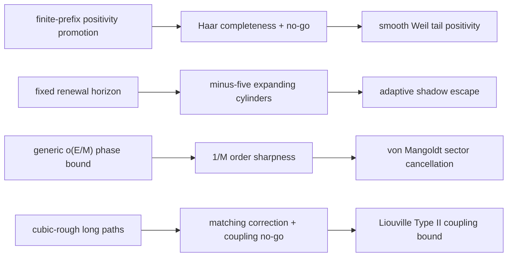

# TICKET-148: Multiscale Completeness, Renewal Shadows, Phase Sharpness, and Matching Coupling

> **TICKET-149 continuation / 후속 연구.** The open nodes recorded here are
> refined in [TICKET-149](smooth-escape-wheel-cover.md): smooth Meyer
> completeness is separated from relative tail coercivity; the minus-five
> shadow receives an exact finite escape classification; the Goldbach route
> is reorganized around an exact squarefree-wheel main term and residual
> transfer; and the Twin target is weakened from full matching coupling to a
> semiprime endpoint-cover deficit. All four conjectures remain open.
>
> 여기의 열린 노드는 [TICKET-149](smooth-escape-wheel-cover.md)에서
> 정교화한다. Meyer 완전성과 상대적 tail coercivity를 분리하고, `-5`
> shadow의 정확한 유한 탈출형을 분류하며, 골드바흐를 squarefree-wheel
> 주항과 residual 전이 문제로 재구성하고, 쌍둥이 소수의 표적을 full
> coupling보다 약한 semiprime endpoint-cover 결손으로 바꾼다. 네 난제는
> 모두 미해결이다.

Date: 2026-07-27

Status: `open_not_proven` for all four conjectures

Machine record:
`data/open-problem/ticket148-multiscale-renewal-sharpness-matching.json`

## Publication boundary / 논문 제출용 주장 경계

**English.** TICKET-148 proves four exact intermediate statements and does
not prove or disprove any of the four target conjectures. It also corrects
one application made in TICKET-147. The Riemann track proves completeness of
an explicit multiscale Haar system in `L2(R)` and proves that completeness
does not promote positivity on any finite prefix to global positivity. The
Collatz track constructs, for every fixed renewal horizon, a positive
2-adic cylinder that follows that horizon and expands. The Goldbach track
proves that the `O(E/M)` phase-quantization rate from TICKET-147 is
order-sharp even for nonnegative real functions. The Twin Prime track proves
that the actual TICKET-142 cubic-rough support is a matching for `X>=13`,
not a long path forest, and then proves that topology and endpoint marginals
still do not determine the joint parity coupling. No literature-priority
claim is made.

**한국어.** TICKET-148은 네 난제 자체가 아니라 네 개의 정확한
중간정리를 증명하며, TICKET-147의 실제 데이터 적용 한 곳을 교정한다.
리만 트랙에서는 명시적인 다중 스케일 Haar 계가 `L2(R)`에서 완전함을
증명하지만, 완전한 좌표계라도 유한 개 좌표에서 확인한 양성만으로 전체
양성을 결론낼 수 없음을 반례로 보인다. 콜라츠 트랙에서는 임의의 고정
갱신 길이마다 그 길이 전체를 따라가면서 증가하는 양의 2-adic cylinder를
구성한다. 골드바흐 트랙에서는 TICKET-147의 위상 양자화 오차
`O(E/M)`이 비음수 실함수에서도 차수상 최선임을 증명한다. 쌍둥이 소수
트랙에서는 TICKET-142의 실제 cubic-rough support가 `X>=13`에서 긴
경로가 아니라 서로 겹치지 않는 간선들의 matching임을 증명하고,
matching 구조와 양 끝 marginal만으로도 joint parity coupling은
결정되지 않음을 보인다. 학계 최초성은 주장하지 않는다.

## Result table / 결과표

| Problem / 문제 | New exact result / 새 정확 결과 | Rejected route / 폐기 경로 | One next lemma / 다음 단일 보조정리 |
|---|---|---|---|
| RH / 리만 | `DyadicHaarMultiscaleCompletenessAndFiniteScalePositivityNoGo` | complete coordinates plus finite-prefix positivity / 완전 좌표계와 유한 prefix 양성만으로 전역 양성 결론 | `SmoothWeilWaveletCoreAndUniformMatrixTailPositivityBound` |
| Collatz / 콜라츠 | `MinusFiveCylinderNoFixedRenewalHorizon` | one fixed renewal depth forces universal descent / 하나의 고정 갱신 깊이가 모든 정수를 하강시킨다는 주장 | `AdaptiveRenewalRankEscapingMinusFiveTwoAdicShadow` |
| Goldbach / 골드바흐 | `NonnegativeEndpointPhaseQuantizationOrderSharpness` | generic `o(E/M)` phase error from positivity and energy / 비음수성과 energy만으로 얻는 일반적 `o(E/M)` 오차 | `VonMangoldtEndpointSectorCancellationBeyondSharpGeometricRate` |
| Twin Prime / 쌍둥이 소수 | `CubicRoughGapTwoMatchingAndCouplingNoGo` | cubic-rough long-path target and marginal closure / cubic-rough 장경로 표적과 marginal만의 결합 결정 | `CubicRoughLiouvilleMatchingCouplingTypeIIBound` |

The machine audit records four exact theorems, four rejected targets, four
three-node proof DAGs, one historical correction, zero conjecture
resolutions, and zero failed checks.

기계 감사에는 정확한 정리 4개, 폐기 표적 4개, 세 노드 proof DAG 4개,
역사적 교정 1개, 난제 해결 0개, 실패한 검사 0개가 기록된다.

## 1. Riemann Hypothesis / 리만 가설

### Declared proposition / 선언 명제

Let the unit-interval scaling functions and all dyadic Haar wavelets on
`R` be normalized in `L2`. They form a complete orthonormal basis of
`L2(R)`.

그러나 이 완전성은 다음 명제를 함의하지 않는다.

```text
positivity on the first N basis directions
=> positivity on the whole test space.                 (1)
```

For every `N`, there is a bounded self-adjoint operator for which the left
side of (1) holds and the right side fails.

### Proof / 증명

On every unit interval, let `E_j f` be the conditional expectation of `f`
on dyadic cells of length `2^(-j)`. The martingale convergence theorem, or
equivalently density of dyadic step functions, gives

```text
E_j f -> f in L2 as j -> infinity.
```

The difference `E_(j+1)f-E_j f` lies in the span of the Haar wavelets at
scale `j`. First truncate `f` to finitely many unit intervals, then refine
the dyadic partition. The scaling functions and all detail spaces therefore
have dense span. Orthogonality and normalization give a complete
orthonormal basis.

각 단위 구간에서 dyadic 조건부 평균을 계속 세분하면 `L2` 함수에
수렴하고, 연속한 두 조건부 평균의 차이가 바로 해당 scale의 Haar
wavelet 공간이다. 먼저 유한 개 단위 구간으로 자르고 다음에 dyadic
분할을 세분하면 전체 실선에서도 조밀성이 성립한다.

Now enumerate this complete basis as `e_1,e_2,...` and define

```text
A_N e_j = e_j       for j != N+1,
A_N e_(N+1) = -e_(N+1).
```

`A_N` is bounded and self-adjoint. Its quadratic form is `+1` on
`e_1,...,e_N` and `-1` on `e_(N+1)`. This proves the no-go in (1).

완전한 좌표계가 있다는 사실과 그 좌표계의 유한 prefix에서 양성이
확인됐다는 사실은 서로 다른 양화사를 가진다. 보이지 않은 다음 좌표의
부호를 음수로 둔 위 대각 작용소가 정확한 반례다.

### Reproducible computation / 재현 계산

For levels `J=1,...,8`, the script constructs the unnormalized discrete Haar
matrix on `2^J` cells. Exact rational elimination verifies full rank, and
exact integer dot products verify pairwise orthogonality. A negative
diagonal entry immediately after each tested prefix verifies the
finite-prefix countermodel.

```powershell
D:\python\anaconda3\python.exe scripts\ticket148_multiscale_renewal_sharpness_matching.py
D:\python\anaconda3\python.exe -m unittest tests.test_ticket148_multiscale_renewal_sharpness_matching -v
```

### Limit and next lemma / 한계와 다음 보조정리

Haar wavelets are discontinuous and this theorem is an `L2(R)` theorem.
The exact Weil criterion has a particular smooth test class, topology, and
quadratic form. The synthetic diagonal operator above is not a Weil
operator. Therefore no zeta zero has been located or excluded.

Haar 완전성을 Weil test space의 완전성으로 바꾸거나, 합성 대각
작용소를 실제 Weil 행렬로 바꾸면 논리적 비약이다. 다음 단일 표적은

```text
SmoothWeilWaveletCoreAndUniformMatrixTailPositivityBound.
```

It must put a smooth multiscale core inside the exact Weil topology and
prove a uniform positive bound on the untested matrix tail without assuming
RH.

## 2. Collatz conjecture / 콜라츠 추측

### Declared proposition / 선언 명제

Write `T(n)=(3n+1)/2^v2(3n+1)` for the accelerated map on positive odd
integers. For every `L>=1`, define

```text
n_L = 2^(3L+1)-5.                                  (2)
```

Then the first `2L` valuations are exactly

```text
(1,2,1,2,...,1,2) = (1,2)^L,
```

and

```text
T^(2L)(n_L)=2*9^L-5 > n_L.                         (3)
```

More strongly, every nonnegative lift

```text
n=n_L+2^(3L+1)t
```

has the same valuation word and maps to

```text
T^(2L)(n)=2*9^L(1+t)-5>n.                          (4)
```

### Proof / 증명

For `r>=1` and integer `c>=1`, put

```text
x=2*c*8^r-5.
```

Then

```text
3x+1=2(3*c*8^r-7),
```

and the parenthesis is odd, so the first valuation is exactly one. Its
accelerated image is `3*c*8^r-7`. Applying the map once more gives

```text
3(3*c*8^r-7)+1
 = 4(2*(9c)*8^(r-1)-5),
```

where the last factor is odd. Thus one pair of steps sends

```text
(c,r) -> (9c,r-1).                                 (5)
```

Starting with `c=1+t,r=L` and iterating (5) proves (4). Since `9^L>8^L`,
the image is larger than the input.

이 식은 관찰적 stopping-time 패턴이 아니라 모든 `t>=0`에 대해 성립하는
정확한 항등식이다. 해당 residue cylinder의 홀수 2-adic 공간 내 Haar
질량은 `2^(-3L)`이다.

### No-go meaning / no-go의 의미

For every proposed fixed number `L` of repeated renewal pairs, there are
infinitely many positive integers that survive exactly that horizon and
increase. Hence no theorem of the form

```text
one universal fixed renewal depth forces descent for every odd n
```

can be true.

이는 발산 궤도를 만들지 않는다. 각 `L`에 사용하는 시작값이 다르며,
고정 길이 이후에는 하강할 수 있다. 이 족은 알려진 음의 2-adic
`-5,-7` 주기를 유한 시간 shadow하는 양의 정수들이며, 음의 2-adic
주기를 양의 정수 반례로 오인해서는 안 된다.

The next single lemma is

```text
AdaptiveRenewalRankEscapingMinusFiveTwoAdicShadow.
```

It must use an adaptive, unbounded horizon and prove that every positive
integer eventually escapes these arbitrarily long shadows into a certified
descent state.

## 3. Strong Goldbach conjecture / 강한 골드바흐 추측

### Declared proposition / 선언 명제

For `M` divisible by four, set

```text
q=4M^2,
N=M^2+2M-1,
f(x)=1+cos(2*pi*x/q) on Z/qZ.                     (6)
```

Then `f(x)>=0`. Let `c_N=(f*f)(N)` and let `c_N^(M)` be obtained by rounding
each endpoint Fourier phase to the nearest of `M` equally spaced sectors.
With `E=sum_x f(x)^2`,

```text
|c_N-c_N^(M)|
 = (q/2) sin(pi/M-pi/(2M^2)),
E=3q/2,
M |c_N-c_N^(M)| / E -> pi/3.                     (7)
```

Thus a universal `o(E/M)` phase-quantization bound is impossible even after
assuming nonnegativity, reality, and conjugate Fourier symmetry.

### Proof / 증명

With the unnormalized discrete Fourier transform,

```text
f_hat(0)=q,
f_hat(1)=f_hat(-1)=q/2,
```

and every other coefficient is zero. Therefore

```text
c_N=q+(q/2)cos(theta),
theta=2*pi*N/q
     =pi/2+delta,
delta=pi/M-pi/(2M^2).                             (8)
```

The nearest `M`-sector angle to `theta` is `pi/2`. The rounded `+1` and
`-1` frequency contributions cancel, so `c_N^(M)=q`. Equations (7) follow
from `cos(pi/2+delta)=-sin(delta)` and Parseval.

Fourier coefficient의 크기뿐 아니라 endpoint `N`이 만드는 위상을
보존해야 한다. 비음수성과 실수 대칭까지 넣어도 일반적 기하 오차의
차수는 `1/M`보다 좋아지지 않는다.

### Limit and next lemma / 한계와 다음 보조정리

The function in (6) is not the von Mangoldt function. The theorem does not
exclude cancellation specific to primes, a major/minor-arc argument, or a
Goldbach representation. It only proves that generic geometry and energy
cannot improve the TICKET-147 rate.

다음 단일 표적은

```text
VonMangoldtEndpointSectorCancellationBeyondSharpGeometricRate.
```

It must obtain extra cancellation from the arithmetic structure of
`Lambda`, rather than reusing nonnegativity and Parseval alone.

## 4. Twin Prime conjecture / 쌍둥이 소수 추측

### Declared proposition and correction / 선언 명제와 교정

TICKET-142 admits an edge `(n,n+2)` at scale `X` when

```text
spf(n)^3>2X+2 and spf(n+2)^3>2X+2.                (9)
```

For every `X>=13`, this support graph is a matching: no two admitted edges
share a vertex.

TICKET-147 correctly proved a path-cut identity for general gap-two
supports, but its long-path counterfamily cannot occur in the actual support
defined by (9). This ticket records that scope correction rather than
silently rewriting the historical artifact.

TICKET-147은 일반적인 gap-two graph에 대해서는 옳은 항등식을
증명했다. 그러나 TICKET-142의 실제 조건에서는 그 graph가 긴 path를
포함하지 않는다. 따라서 장경로 반례를 실제 cubic-rough support에
적용한 부분은 철회하고 matching coupling 문제로 교체한다.

### Matching proof / matching 증명

Suppose `(n,n+2)` and `(n+2,n+4)` were both admitted. Because

```text
3^3=27<=2X+2,
```

all three numbers would have smallest prime factor greater than `3`. But one
of `n,n+2,n+4` is divisible by `3`. Since these numbers are at least `13`,
its smallest prime factor is `3`, contradicting (9). Hence maximum degree
is one.

세 개의 연속한 홀수 `n,n+2,n+4` 중 하나는 반드시 3의 배수다. 반면
두 간선이 모두 살아 있으려면 세 수 모두 작은 소인수 3을 피해야 하므로
모순이다.

### Coupling no-go / 결합 no-go

On `4m` disjoint edges, compare two abstract sign assignments:

```text
correlated:     2m (++), 2m (--),
anticorrelated: 2m (+-), 2m (-+).
```

Both have

```text
(A00,A10,A01)=(4m,0,0),
```

but their joint terms and twin cells are

```text
A11=+4m, N--=2m
A11=-4m, N--=0.                                  (10)
```

Thus matching topology and both endpoint marginals do not determine the
joint coupling. The exact inverse Walsh transform is

```text
N++=(A00+A10+A01+A11)/4,
N+-=(A00+A10-A01-A11)/4,
N-+=(A00-A10+A01-A11)/4,
N--=(A00-A10-A01+A11)/4.                         (11)
```

TICKET-142의 네 실제 행에도 (11)을 적용해 모든 cell count를 정확히
복원했고, `N--`가 직접 계산한 twin count `26,137,936,6702`와
일치함을 확인했다.

### Limit and next lemma / 한계와 다음 보조정리

The labels in (10) are abstract, not values of the Liouville function.
Therefore (10) proves information insufficiency, not a twin-prime theorem.
The next single lemma is

```text
CubicRoughLiouvilleMatchingCouplingTypeIIBound.
```

It must estimate the actual endpoint coupling on the arithmetic matching by
a uniform Type II bilinear bound strong enough to force a positive `--`
cell count at unbounded scales.

## Proof DAG summary / 증명 DAG 요약



The first node of each row is rejected, the middle node is proved in this
ticket, and the last node remains open. None of the last nodes is assumed in
the computation.

각 줄의 첫 노드는 반증 또는 적용 불가, 가운데 노드는 이번에 증명,
마지막 노드는 미증명 상태다. 계산에서 마지막 노드를 가정하지 않는다.

## Reproduction and artifacts / 재현과 산출물

Canonical commands:

```powershell
D:\python\anaconda3\python.exe scripts\ticket148_multiscale_renewal_sharpness_matching.py
D:\python\anaconda3\python.exe -m unittest tests.test_ticket148_multiscale_renewal_sharpness_matching -v
D:\python\anaconda3\python.exe scripts\verify_open_problem_structure.py
node scripts\verify_pages.cjs
```

Artifacts:

- `data/open-problem/ticket148-multiscale-renewal-sharpness-matching.json`
- `data/open-problem/riemann/rh-ticket-148-haar-multiscale-no-go.json`
- `data/open-problem/collatz/co-ticket-148-minus-five-renewal-no-go.json`
- `data/open-problem/goldbach/gb-ticket-148-phase-rate-sharpness.json`
- `data/open-problem/twin-prime/tp-ticket-148-matching-coupling-correction.json`
- `tests/test_ticket148_multiscale_renewal_sharpness_matching.py`

## Literature boundary / 문헌 경계

- I. Daubechies, *Orthonormal Bases of Compactly Supported Wavelets*:
  [publisher record](https://onlinelibrary.wiley.com/doi/abs/10.1002/cpa.3160410705),
  [author-hosted PDF](https://math.duke.edu/~ingrid/publications/cpam41-1988.pdf).
- D. J. Bernstein and J. C. Lagarias, *The 3x+1 Conjugacy Map*:
  [journal page](https://www.cambridge.org/core/journals/canadian-journal-of-mathematics/article/3x-1-conjugacy-map/6975BB4A8C46CF6842217043AAF9EC13),
  [author-hosted paper](https://cr.yp.to/papers/3x1conjmap-19960215-retypeset20220326.pdf).
- H. A. Helfgott, major- and minor-arc papers for ternary Goldbach:
  [major arcs](https://arxiv.org/abs/1305.2897),
  [minor arcs](https://arxiv.org/abs/1205.5252).
- J. Friedlander and H. Iwaniec, *Asymptotic Sieve for Primes*:
  [arXiv record](https://arxiv.org/abs/math/9811186).

These references establish the surrounding wavelet, 2-adic Collatz,
circle-method, and parity-problem context. PrimeProject claims only the
explicit statements and audits written above, not priority for the general
ideas.

위 문헌은 wavelet, 2-adic 콜라츠, 원 방법, parity barrier의 알려진
배경을 제공한다. PrimeProject의 주장은 이 문서에 명시된 정확한
명제와 계산 감사로 제한된다.
