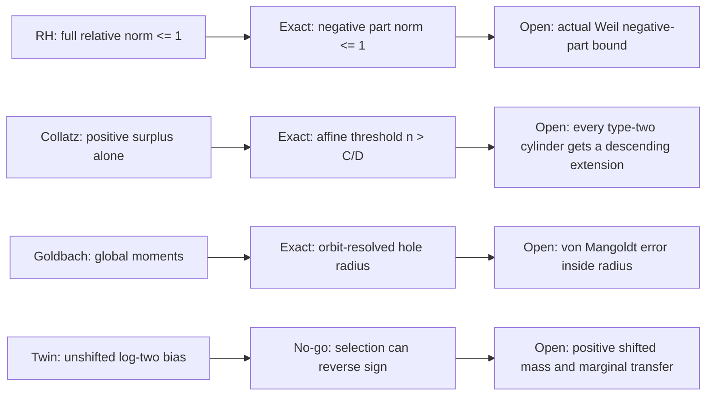

# TICKET-151: Negative Spectrum, Affine Thresholds, Reflection Transversals, and the Log-Two Bias

**Status:** four exact partial or no-go theorems; all four conjectures remain
open.

**상태:** 네 개의 정확한 부분 정리 또는 실패 경로 정리를 확립했지만,
리만 가설·콜라츠 추측·강한 골드바흐 추측·쌍둥이 소수 추측은 모두
미해결이다.

## Abstract / 초록

**English.** TICKET-151 sharpens the four open obligations from TICKET-150.
For the Riemann hypothesis, it replaces the unnecessarily strong two-sided
relative-form bound by the exact one-sided negative spectral criterion. For
Collatz, it proves the exact affine descent threshold for every finite
valuation word and gives a natural counterexample to the claim that positive
valuation surplus alone forces descent. For strong Goldbach, it computes the
exact weighted distance to an endpoint-reflection hole and proves that no
permutation-invariant collection of global moments determines endpoint
positivity. For Twin Prime, it derives the one-variable cubic-rough
prime/semiprime ratio `1:log 2` and proves by matched countermodels that this
bias cannot be transferred to gap-two selected edges without a shifted
theorem. These results correct the targets; they do not prove or disprove any
of the four conjectures.

**한국어.** TICKET-151은 TICKET-150이 남긴 네 보조정리를 더 정확한
형태로 바꾼다. 리만 가설에서는 양의 방향까지 제한하던 양측 상대 form
norm 대신, 음의 스펙트럼 부분만 제어하는 필요충분조건을 증명한다.
콜라츠에서는 모든 유한 valuation word의 정확한 affine 하강 임계값을
증명하고, 누적 valuation surplus가 양수라는 사실만으로는 하강이
보장되지 않는 실제 자연수 반례를 제시한다. 강한 골드바흐에서는 가중
반사 궤도에서 endpoint hole까지의 정확한 거리를 계산하고, 전역 모멘트나
가중치 histogram만으로 특정 endpoint의 양성을 결정할 수 없음을
증명한다. 쌍둥이 소수에서는 cubic-rough 집합의 소수 대 semiprime 비가
점근적으로 `1:log 2`임을 유도하지만, 같은 주변 분포에서도 gap-two
선택 방식에 따라 부호가 반대가 될 수 있음을 보인다. 따라서 shifted
상관 정리가 별도로 필요하다. 어느 결과도 네 난제의 완전한 증명이나
반례가 아니다.

## 1. Result ledger / 결과 원장

| Problem / 문제 | Exact result / 정확한 새 결과 | Discarded route / 폐기 경로 | Single next lemma / 다음 단일 보조정리 |
|---|---|---|---|
| RH / 리만 | `OneSidedNegativeRelativeFormCriterionAndFullNormNoGo` | 실제 형식에도 반드시 `||B||<=1`을 요구하는 양측 norm 경로 | `ActualWeilNegativeRelativeFormPartBoundAtMostOne` |
| Collatz / 콜라츠 | `ExactAffineStoppingThresholdAndPositiveSurplusNoGo` | `2^S>3^m`만으로 하강을 선언하는 경로 | `TypeTwoAffineThresholdCylinderCoverBelowShadowEntry` |
| Goldbach / 골드바흐 | `WeightedReflectionHoleRadiusAndPermutationMomentNoGo` | 전역 모멘트·에너지·unordered histogram만으로 endpoint 양성을 옮기는 경로 | `OrbitResolvedVonMangoldtApproximationInsideWeightedHoleRadiusK56` |
| Twin Prime / 쌍둥이 소수 | `CubicRoughLogTwoBiasAndShiftedSelectionNoGo` | 한 변수 `log 2` 편향을 gap-two 선택 집합으로 바로 옮기는 경로 | `PositiveGapTwoCubicRoughMassAndShiftedLogTwoMarginalTransfer` |

Machine-readable audit / 기계 판독 감사:
[`ticket151-negative-affine-transversal-logtwo.json`](../data/open-problem/ticket151-negative-affine-transversal-logtwo.json).

Reproduction / 재현:

```powershell
python scripts/ticket151_negative_affine_transversal_logtwo.py
python -m unittest tests.test_ticket151_negative_affine_transversal_logtwo -v
python scripts/verify_open_problem_structure.py
```

## 2. Riemann hypothesis / 리만 가설

### 2.1 Declared proposition / 선언 명제

Let `p` be the closed nonnegative form of a self-adjoint operator `P` with
trivial kernel. Suppose a symmetric perturbation has the relative
representation

```text
k[v,w] = <P^(1/2)v, B P^(1/2)w>,
```

where `B` is bounded and self-adjoint. Let
`B_- = max(-B,0)` be its negative spectral part. Then

```text
p+k is nonnegative
    iff B >= -I
    iff ||B_-|| <= 1.
```

The full condition `||B||<=1` is sufficient but not necessary.

`P`의 kernel이 자명하고 `p`가 그 닫힌 비음수 form이라고 하자.
perturbation `k`가 bounded 자기수반 작용소 `B`를 통해 위와 같이
표현되면, 합성 form의 비음수성은 `B`의 음의 스펙트럼 부분
`B_-=max(-B,0)`의 norm이 `1` 이하라는 조건과 정확히 동치다. 양의
스펙트럼이 아무리 커도 비음수성을 해치지 않으므로 전체 norm
`||B||<=1`은 필요조건이 아니다.

### 2.2 Proof / 증명

Put `u=P^(1/2)v`. Then

```text
(p+k)[v] = <u,(I+B)u>.
```

Because the range of `P^(1/2)` is dense when `ker P={0}`, nonnegativity on
the form domain is equivalent to `I+B>=0`. Spectral calculus gives

```text
I+B >= 0 iff inf spectrum(B) >= -1 iff ||B_-|| <= 1.
```

For the exact no-go family, take

```text
B = diag(M,-a),   M>1, 0<=a<=1.
```

Then `||B||=M` can be arbitrarily large, while
`min spectrum(I+B)=1-a>=0`. If `a>1`, the second coordinate gives the
negative value `1-a`; an arbitrarily large positive first eigenvalue cannot
repair it.

`u=P^(1/2)v`로 치환하면 문제는 `I+B`의 양성으로 정확히 바뀐다.
`ker P={0}`이면 `P^(1/2)`의 range가 조밀하므로 form domain에서의
비음수성과 `I+B>=0`이 동치다. 스펙트럼 함수 계산으로 이는
`||B_-||<=1`과 같다. 대각 예 `diag(M,-a)`는 양의 고윳값 `M`이 전체
norm을 무한히 키워도 `a<=1`이면 안전하고, `a>1`이면 즉시 음의 방향이
생긴다는 것을 정확히 보여준다.

### 2.3 Reproducible audit / 재현 계산

The audit contains 48 exact rows with `M>1`, `0<=a<=1`, and 16 exact rows
with `a>1`. Every rational equality is stored as a fraction. The first group
violates the discarded full-norm target while preserving positivity; the
second group crosses the exact negative-part boundary.

감사 데이터는 `M>1`, `0<=a<=1`인 유리수 행 48개와 `a>1`인 행
16개를 포함한다. 첫 집합은 전체 norm 조건을 위반해도 합성 form이
비음수이고, 둘째 집합은 음의 부분 norm 임계값 `1`을 넘는 순간 음의
방향이 생김을 재계산한다.

### 2.4 Limit and next lemma / 한계와 다음 보조정리

This is an abstract operator theorem. It does not construct the operator `B`
for Weil's actual prime and archimedean terms and controls no zeta zero.
The next theorem is exactly:

```text
ActualWeilNegativeRelativeFormPartBoundAtMostOne
```

즉, 실제 Weil 형식에서 상대 작용소를 만들고 그 **음의 부분만** `1`
이하로 제한해야 한다. 이 연결이 없으므로 리만 가설은 미해결이다.
Current context:
[Suzuki, *Weil's quadratic form via the screw function*](https://arxiv.org/abs/2606.09096).

## 3. Collatz conjecture / 콜라츠 추측

Use the accelerated odd map

```text
T(n) = (3n+1)/2^v2(3n+1).
```

### 3.1 Declared proposition / 선언 명제

For a realized valuation word `a_1,...,a_m`, put

```text
S_i = a_1+...+a_i,   S=S_m,
C_0=0,
C_i = 3 C_(i-1) + 2^S_(i-1).
```

Then every realizing positive odd `n` satisfies

```text
T^m(n) = (3^m n + C_m)/2^S.
```

Writing `D=2^S-3^m`, strict descent occurs exactly when

```text
D>0 and n > C_m/D.
```

Thus positive valuation surplus `D>0` is necessary but not sufficient.

valuation word가 고정되면 `m`단계 합성은 정확한 affine 함수가 된다.
하강 여부는 누적 지수 `S`만이 아니라 양의 상수항 `C_m`과 시작점 `n`의
크기까지 포함한 `n>C_m/D`로 결정된다. 따라서 `2^S>3^m`만 확인하는
전략에는 논리적 간극이 있다.

### 3.2 Proof and counterexample / 증명과 반례

The affine formula follows by induction. Subtracting `n` gives

```text
T^m(n)-n = (C_m-Dn)/2^S,
```

which proves the threshold. A natural counterexample to the surplus-only
rule is

```text
n=165, m=17, S=27,
D=2^27-3^17=5,077,565>0,
T^17(165)=167>165.
```

Here `C_m/D` is approximately `217.867`, so `165` lies below the exact
descent threshold. The exact word cylinder also contains
`165+2^(S+1)=268,435,621`, which follows the same word but lies above the
threshold and descends after 17 steps. This proves that the Archimedean
position inside a two-adic cylinder matters.

귀납으로 affine 식을 얻고 `n`을 빼면 임계 부등식이 바로 나온다.
`165`는 `D>0`이지만 임계값보다 작아 17단계 뒤 `167`로 증가한다.
반면 같은 valuation word를 갖는 큰 cylinder lift는 임계값을 넘어
하강한다. 같은 2-adic word 안에서도 자연수 크기 정보가 필요하다는
뜻이다.

For every TICKET-150 forced type-two word

```text
(1,2)^L, (1,1), 1^H,
```

the multiplier ratio is

```text
3^m/2^S = (9/8)^L (3/2)^(H+2) > 1.
```

Therefore `D<0`; none of these forced finite horizons can descend below its
own start. The audit checks 35 such exact words and 32 positive-surplus
natural counterexamples.

TICKET-150의 강제 type-two word는 위 비율이 항상 `1`보다 크므로
`D<0`이다. 따라서 강제로 보장된 그 유한 구간 자체에서는 시작점 아래
하강이 불가능하다. 감사 데이터는 이러한 행 35개와 `D>0`인데도 하강하지
않는 실제 자연수 행 32개를 검증한다.

### 3.3 Limit and next lemma / 한계와 다음 보조정리

A fixed word is finite. The threshold theorem does not prove that every
type-two cylinder has a suitable extension. The next exact obligation is:

```text
TypeTwoAffineThresholdCylinderCoverBelowShadowEntry
```

모든 type-two cylinder에 대해 어떤 연장 word가 존재하고, 그 연장의
임계값이 해당 자연수와 shadow 진입점보다 낮다는 균일 cover 정리가
필요하다. 이를 증명하지 않았고 발산 궤도도 찾지 않았으므로 콜라츠
추측은 미해결이다. Current context:
[Niu, *Parity vectors and paradoxical sequences in the accelerated Collatz map*](https://arxiv.org/abs/2605.13886).

## 4. Strong Goldbach conjecture / 강한 골드바흐 추측

### 4.1 Declared proposition / 선언 명제

Let `tau` be an involution of a finite set and let `w>=0`. Define the endpoint
reflection mass

```text
R_tau(f) = sum_a f(a) f(tau(a)).
```

The exact squared `L2` distance from `w` to the nonnegative endpoint-hole set
`{f>=0:R_tau(f)=0}` is

```text
rho_tau(w)^2
 = sum over two-cycles {a,b} min(w(a)^2,w(b)^2)
   + sum over fixed points {a} w(a)^2.
```

Therefore `||f-w||_2^2<rho_tau(w)^2` forces `R_tau(f)>0`, and equality is
sharp.

유한 집합의 반사 involution `tau`를 궤도로 분해하자. 두 점 궤도에서는
곱을 0으로 만들려면 둘 중 하나를 0으로 만들어야 하므로 더 작은
제곱만큼 이동하는 것이 최적이다. 고정점에서는 그 좌표 자체를 0으로
만들어야 한다. 이 합이 endpoint convolution을 0으로 만드는
비음수 벡터까지의 정확한 제곱 거리다.

### 4.2 Proof and global-moment no-go / 증명과 전역 모멘트 no-go

Each two-cycle contributes `2f(a)f(b)` to `R_tau(f)`, so a hole requires
`f(a)=0` or `f(b)=0`. Orthogonality of distinct coordinates makes the
minimization additive over orbits. The formula and sharpness follow.

However, global moments do not determine endpoint mass. On `Z/4` at endpoint
`N=3`, for every `s>0`,

```text
f=(2s,s,0,0),   g=(2s,0,0,s).
```

They are permutations of the same multiset, hence have identical power
moments of every order, identical energy, and identical histograms, but

```text
(f*f)(3)=0,   (g*g)(3)=4s^2.
```

따라서 어떤 수의 전역 power moment를 추가해도 좌표가 endpoint 반사
쌍에 어떻게 배치되는지 잃으면 양성을 판정할 수 없다. 필요한 정보는
전역 크기가 아니라 각 반사 궤도에 남아 있는 질량이다.

The audit checks 16 exact scales of this counterfamily. A separate finite
prime-indicator audit finds positive radius for every even endpoint through
20,000; that finite observation is explicitly not promoted to a theorem for
all even integers.

감사 데이터는 위 counterfamily의 16개 scale을 정확 산술로 확인한다.
소수 indicator 계산은 20,000 이하 모든 짝수 endpoint에서 양의
반지름을 관찰하지만, 이는 유한 검산일 뿐 모든 짝수에 대한 증명이 아니다.

### 4.3 Limit and next lemma / 한계와 다음 보조정리

The exact remaining theorem is:

```text
OrbitResolvedVonMangoldtApproximationInsideWeightedHoleRadiusK56
```

major-arc 기준 가중치와 실제 von Mangoldt 가중치의 오차를 각 endpoint
반사 궤도별로 추적하고, 그 오차가 정확한 hole 반지름보다 작음을
`K56` 규모에서 증명해야 한다. 현재 결과는 유한 기하 정리이고 실제
Goldbach convolution의 전 scale 하한이 아니므로 강한 골드바흐 추측은
미해결이다. Analytic context:
[Helfgott, *Minor arcs for Goldbach's problem*](https://arxiv.org/abs/1205.5252).

## 5. Twin Prime conjecture / 쌍둥이 소수 추측

### 5.1 Declared proposition / 선언 명제

Let `y=X^(1/3)` and consider integers `n<=X` with no prime factor at most
`y`. Such an `n` is either prime or a product of two primes: three factors
larger than `X^(1/3)` would have product larger than `X`. Let `P_X` and `D_X`
denote the prime and semiprime populations. The prime number theorem and
partial summation give

```text
P_X ~ X/log X,
D_X ~ (log 2) X/log X,
```

because

```text
integral_(1/3)^(1/2) dt/[t(1-t)] = log 2.
```

Consequently, on this one-variable support,

```text
(P_X-D_X)/(P_X+D_X)
    -> (1-log 2)/(1+log 2) > 0
```

for the prime-minus-semiprime sign, or equivalently the Liouville mean tends
to

```text
(log 2-1)/(log 2+1) < 0.
```

`X^(1/3)` 이하의 소인수를 모두 제거한 수는 정확히 소수 또는 두 소수의
곱이다. PNT와 부분합을 적용하면 semiprime 수는 소수 수의 `log 2`배로
수렴한다. 따라서 한 변수 cubic-rough 집합에는 정량적인 음의 Liouville
평균이 있다.

### 5.2 Shifted-selection no-go / shifted 선택 no-go

This marginal bias alone says nothing about the set selected by requiring
both `n` and `n+2` to be cubic-rough. Given the same ambient populations
`P_X,D_X` on the left and right, select a matching of size at most
`min(P_X,D_X)`. One may select only prime-prime edges, giving positive
`T-D`, or only semiprime-semiprime edges, giving negative `T-D`. Thus
identical unshifted marginals admit opposite selected signs.

주변의 소수·semiprime 개수가 완전히 같아도 gap-two 간선을 어떤
부분집합으로 선택하는지에 따라 `prime-prime` 간선만 남기거나
`semiprime-semiprime` 간선만 남길 수 있다. 두 경우의 cover deficit
부호는 반대다. 그러므로 한 변수 `log 2` 편향을 shifted support로
자동 이전하는 것은 논리적으로 불가능하다.

The finite arithmetic rows for `X=10^3,10^4,10^5,10^6` verify that every
cubic-rough composite counted is semiprime and that the finite ratio moves
toward `log 2`. The actual finite gap-two rows happen to have negative left
and right conditioned Liouville means, but four finite samples do not prove
an asymptotic shifted estimate.

`X=10^3`부터 `10^6`까지의 계산에서는 cubic-rough composite가 모두
semiprime이고 비율이 `log 2`에 가까워진다. 실제 gap-two 유한 표본에서도
좌우 조건부 Liouville 평균이 음수이지만, 네 개의 유한 표본은 무한한
shifted 상관 부등식을 증명하지 않는다.

### 5.3 Limit and next lemma / 한계와 다음 보조정리

The next theorem must combine existence of selected edges with a quantitative
transfer:

```text
PositiveGapTwoCubicRoughMassAndShiftedLogTwoMarginalTransfer
```

즉, gap-two cubic-rough 간선 질량이 충분히 크다는 하한과, 그 선택
집합에서도 한 변수 `log 2` 편향의 일정 비율이 보존된다는 shifted
추정을 동시에 증명해야 한다. 현재 결과에는 이런 Type I/II 상관
추정이 없으므로 쌍둥이 소수 추측은 미해결이다. Sieve boundary:
[Ford and Maynard, *On the theory of prime producing sieves*](https://arxiv.org/abs/2407.14368).

## 6. Proof DAG / 증명 방향 그래프



각 행에서 왼쪽은 폐기되거나 불충분한 경로, 가운데는 이번에 정확히
증명한 정리, 오른쪽은 아직 증명되지 않은 단일 보조정리다. 오른쪽
노드 어느 것도 닫히지 않았다.

## 7. Claim boundary / 주장 경계

TICKET-151 establishes:

- one exact abstract spectral equivalence and its full-norm no-go;
- one exact finite-word Collatz threshold and natural counterexamples to a
  surplus-only inference;
- one exact finite weighted reflection geometry theorem and a
  permutation-moment no-go;
- one PNT-derived one-variable asymptotic and a shifted-selection no-go.

TICKET-151 does **not** establish:

- positivity of the actual Weil quadratic form or RH;
- a global Collatz stopping-time cover or a divergent Collatz orbit;
- a positive von Mangoldt Goldbach convolution for every even integer or an
  even counterexample;
- infinitely many twin primes or a counterexample to that conjecture.

한국어로 요약하면, 이번 티켓은 네 경로의 정확한 필요조건과 실패 이유를
한 단계 전진시켰다. 그러나 실제 난제를 닫는 무한·균일 추정은 하나도
증명하지 않았다. 따라서 기계 판독 상태는 네 문제 모두
`open_not_proven`, 해결 수는 `0`이다.
