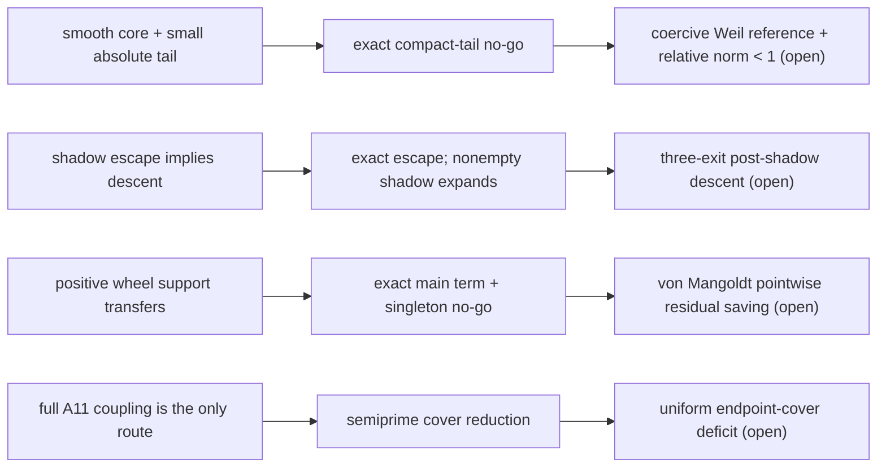

# TICKET-149: Smooth Cores, Exact Shadow Escape, Wheel Transfer, and Semiprime Cover

**Status:** exact intermediate theorems and route reductions; all four
conjectures remain open.

**상태:** 정확한 중간 정리와 경로 환원만 확립했다. 네 난제는 모두
미해결이다.

## Abstract / 초록

**English.** This ticket attacks the four open nodes left by TICKET-148. For
the Riemann hypothesis, it imports the standard Schwartz-class Meyer wavelet
basis and proves that smooth completeness, finite-prefix positivity, and an
arbitrarily small absolute compact tail still do not imply global positivity.
For Collatz, it exactly computes the maximal positive-integer shadow of the
negative 2-adic cycle near `-5`: every positive odd integer exits after a
finite, explicitly determined number of `(1,2)` valuation pairs, but every
nonempty shadow exits above its entry value. For strong Goldbach, it derives
the exact positive squarefree-wheel convolution and a residual transfer
inequality, then proves that wheel support alone admits endpoint holes. For
Twin Prime, it replaces the full joint-coupling target by a weaker sufficient
condition controlling the sum of the two semiprime endpoint covers. None of
these statements proves or disproves a target conjecture.

**한국어.** 이 티켓은 TICKET-148이 남긴 네 열린 노드를 직접 공격한다.
리만 가설에서는 Schwartz 함수인 Meyer 웨이블릿 완전기저를 사용하더라도,
유한 prefix의 양성과 임의로 작은 절대 compact tail만으로는 전역 양성을
얻을 수 없음을 정확한 작용소 반례로 증명한다. 콜라츠에서는 음의
2-adic 주기 `-5,-7` 근처를 따라가는 모든 양의 홀수의 최대 shadow 길이를
정확히 계산한다. 모든 양의 홀수는 유한 시간 안에 그 shadow를 빠져나오지만,
shadow가 한 쌍 이상이면 탈출값은 시작값보다 크다. 강한 골드바흐에서는
squarefree wheel의 양의 convolution 주항과 residual 전이 부등식을
유도하고, wheel 지지만으로는 특정 endpoint의 표현을 보장하지 못함을
반례로 보인다. 쌍둥이 소수에서는 전체 joint coupling 추정보다 약한
semiprime endpoint cover 합의 결손 정리로 충분조건을 환원한다. 어느
결과도 네 난제의 증명이나 반증이 아니다.

## 1. Result ledger / 결과 원장

| Problem / 문제 | Exact result / 정확한 결과 | Rejected route / 폐기 경로 | Next single lemma / 다음 단일 보조정리 |
|---|---|---|---|
| RH / 리만 | `SmoothSchwartzCoreAndAbsoluteCompactTailNoGo` | smooth complete core + finite positivity + small absolute compact tail | `ExplicitWeilWaveletCoerciveReferenceAndRelativeTailNormBelowOne` |
| Collatz / 콜라츠 | `MinusFiveShadowExactEscapeAndDescentNoGo` | shadow escape alone implies descent | `ThreeExitTypePostShadowAdaptiveDescent` |
| Goldbach / 골드바흐 | `SquarefreeWheelLocalMainTermAndResidualTransferNoGo` | positive wheel model transfers without residual control | `VonMangoldtWheelResidualPointwiseBilinearSavingK56` |
| Twin Prime / 쌍둥이 소수 | `CubicRoughSemiprimeEndpointCoverReduction` | full joint `A11` control is the only sufficient route | `CubicRoughSemiprimeEndpointCoverDeficit` |

Machine-readable audit:
[`ticket149-smooth-escape-wheel-cover.json`](../data/open-problem/ticket149-smooth-escape-wheel-cover.json).

Reproduction:

```powershell
D:\python\anaconda3\python.exe scripts/ticket149_smooth_escape_wheel_cover.py
D:\python\anaconda3\python.exe -m unittest tests.test_ticket149_smooth_escape_wheel_cover -v
```

## 2. Riemann hypothesis / 리만 가설

### 2.1 Declared proposition / 선언 명제

Let `(e_j)` be any enumeration of a Schwartz-class Meyer wavelet
orthonormal basis of `L2(R)`. For every `N>=1` and `epsilon>0`, define

```text
A e_j = e_j                    (j <= N),
A e_(N+1) = -epsilon e_(N+1),
A e_j = 0                      (j >= N+2).
```

Then `A` is finite rank, compact, and self-adjoint; its quadratic form is
positive on the first `N` basis directions; the norm of its restriction to
their orthogonal complement is `epsilon`; but
`<A e_(N+1),e_(N+1)>=-epsilon<0`.

`(e_j)`를 Schwartz 함수인 Meyer 웨이블릿 완전정규직교기저라고 하자.
위 대각 작용소는 유한 rank이므로 compact이고 self-adjoint이다. 처음
`N`개 기저 방향의 값은 모두 `1`이며 나머지 부분의 작용소 norm은
`epsilon`이다. 그러나 `N+1`번째 방향의 이차형식 값은
`-epsilon`이므로 전역 양성은 실패한다.

### 2.2 Proof / 증명

The only nonzero eigenvalues are `N` copies of `1` and one copy of
`-epsilon`; hence all operator claims are immediate. Since `epsilon` may be
arbitrarily small, no positive threshold on an **absolute** tail norm can
repair the inference. A valid route needs a positive reference operator `P`
that is coercive on the tail and a **relative** estimate such as
`||P^(-1/2) K P^(-1/2)||<1`.

비영 고윳값은 `1`이 `N`개, `-epsilon`이 한 개뿐이다. 따라서 유한 rank,
compact, self-adjoint 성질과 음의 방향이 즉시 따라온다. `epsilon`을
얼마든지 작게 할 수 있으므로 절대 tail norm의 작음만으로는 이 문제를
고칠 수 없다. 필요한 형태는 tail에서도 양의 하한을 갖는 기준 작용소
`P`와 `||P^(-1/2)KP^(-1/2)||<1` 같은 상대적 추정이다.

The Meyer basis fact is imported from wavelet theory; it is not a result of
the finite diagonal audit. A modern source explicitly recording the Schwartz
and orthonormal-basis properties is
[Christensen--Forster--Massopust](https://arxiv.org/abs/1402.3682).

### 2.3 Boundary / 한계

This is not the Weil form. `L2(R)` completeness is not proved to equal the
exact Weil test topology, and no zeta zero is located or excluded. The result
only closes a proposed inference rule.

이 작용소는 실제 Weil 형식이 아니다. `L2(R)` 완전성과 정확한 Weil
test topology의 동일성도 증명하지 않았다. zeta 영점에 관한 위치 추정도
없다. 확정된 것은 잘못된 추론 규칙의 폐기뿐이다.

## 3. Collatz conjecture / 콜라츠 추측

Use the accelerated odd map

```text
T(n) = (3n+1) / 2^v2(3n+1).
```

### 3.1 Declared proposition / 선언 명제

For every positive odd `n`, set

```text
s = v2(n+5),      L = floor((s-1)/3).
```

The maximal initial valuation word consisting of repeated `(1,2)` pairs has
exactly `L` pairs, and

```text
T^(2L)(n)+5 = (9/8)^L (n+5).                       (1)
```

At exit, `r=s-3L` is `1`, `2`, or `3`. The next valuations respectively
begin with `(>=2,*)`, `(1,1)`, or `(1,>=3)`, so no additional `(1,2)` pair
is possible. If `L>=1`, (1) gives `T^(2L)(n)>n`.

모든 양의 홀수 `n`에 대해 `s=v2(n+5)`,
`L=floor((s-1)/3)`라 하자. 처음부터 반복되는 `(1,2)` valuation 쌍의
최대 개수는 정확히 `L`이고 식 (1)이 성립한다. 탈출 시 남는
`r=s-3L`은 `1,2,3` 중 하나이며 다음 valuation은 각각
`(2 이상,*)`, `(1,1)`, `(1,3 이상)`으로 시작한다. 따라서 `(1,2)`를
더 반복할 수 없다. `L>=1`이면 탈출값은 시작값보다 크다.

### 3.2 Proof / 증명

If `x+5=2c8^q` with `q>=1`, direct substitution gives

```text
v2(3x+1)=1,
v2(3T(x)+1)=2,
T^2(x)+5 = 9(x+5)/8.                              (2)
```

Each pair lowers `v2(x+5)` by exactly three. Iterating (2) proves (1) and
maximality. Substitution at residual orders `1`, `2`, and `3` gives the three
exit types. This finite-shadow structure is consistent with the established
2-adic conjugacy viewpoint; see
[Bernstein--Lagarias](https://www.cambridge.org/core/journals/canadian-journal-of-mathematics/article/3x-1-conjugacy-map/6975BB4A8C46CF6842217043AAF9EC13).

`x+5=2c8^q`, `q>=1`을 직접 대입하면 식 (2)가 나온다. `(1,2)` 한 쌍마다
`v2(x+5)`가 정확히 `3` 감소한다. 따라서 식 (1)과 최대성이 성립한다.
남은 지수가 `1,2,3`인 세 경우를 다시 대입하면 종료형 분류가 나온다.

### 3.3 Boundary / 한계

Every positive integer escapes this particular finite shadow, but escape does
not imply descent: every nonempty shadow expands by `(9/8)^L`. What remains is
a post-exit argument uniform over all three terminal types. No divergent
positive orbit is produced.

모든 양의 정수는 이 특정 shadow를 유한 시간에 벗어나지만, 탈출은
하강이 아니다. 비어 있지 않은 shadow는 `(9/8)^L`만큼 증가한다. 남은
문제는 세 종료형 모두에서 작동하는 post-exit 하강 논증이다. 양의 발산
궤적을 만든 것도 아니다.

## 4. Strong Goldbach conjecture / 강한 골드바흐 추측

### 4.1 Declared proposition / 선언 명제

Let `W>=6` be even and squarefree and
`g(a)=1_(gcd(a,W)=1)` on `Z/WZ`. For every even `N`,

```text
(g*g)(N)
 = product_(p|W, p|N) (p-1)
   product_(p|W, p does not divide N) (p-2) > 0.   (3)
```

For any real `f=g+r`,

```text
(f*f)(N) = (g*g)(N)+2(g*r)(N)+(r*r)(N),            (4)
```

so Cauchy--Schwarz gives the sufficient condition

```text
2 ||g||_2 ||r||_2 + ||r||_2^2 < (g*g)(N).          (5)
```

Nevertheless, for every such `W,N`, there is a reduced residue `a` with
`2a != N (mod W)`. The singleton nonnegative weight `f=1_{a}` is supported
inside the wheel but has `(f*f)(N)=0`.

`W>=6`이 짝수 squarefree이고 `g`가 `W`와 서로소인 잔여류의 지시함수라
하자. 모든 짝수 endpoint `N`에서 정확한 local main term (3)은 양수이다.
일반 가중치 `f=g+r`에는 항등식 (4)와 충분조건 (5)가 성립한다. 그러나
wheel의 허용 잔여류 하나만 지지하는 비음수 singleton 가중치는 특정
endpoint에서 convolution이 `0`일 수 있다.

### 4.2 Proof / 증명

By the Chinese remainder theorem, modulo each `p|W` one must exclude
`a=0` and `a=N`. There is one excluded class if `p|N`, and two otherwise.
Multiplying the local counts proves (3). Equation (4) is bilinearity and (5)
follows from Cauchy--Schwarz. Write `W=2M`. The congruence `2a=N mod W`
has at most one odd solution, whereas `phi(W)>=2`; hence a reduced singleton
hole always exists.

중국인의 나머지 정리에 따라 각 `p|W`에서 `a=0`과 `a=N`을 제외한다.
`p|N`이면 둘이 같은 잔여류라 `p-1`개가 남고, 아니면 `p-2`개가 남는다.
local count를 곱하면 (3)이 된다. (4)는 쌍선형성, (5)는
Cauchy--Schwarz이다. `W=2M`으로 쓰면 `2a=N mod W`의 홀수 해는 많아야
하나지만 `phi(W)>=2`이므로 endpoint를 놓치는 허용 singleton이 존재한다.

This separates the exact local factor from the hard arithmetic residual, in
the spirit of the major/minor-arc division made explicit in
[Helfgott's major-arc](https://arxiv.org/abs/1305.2897) and
[minor-arc](https://arxiv.org/abs/1205.5252) analyses.

### 4.3 Boundary / 한계

The cyclic wheel is not the interval von Mangoldt convolution. The singleton
is not a prime weight and is not a Goldbach counterexample. The unresolved
statement is a pointwise, arithmetic residual bound strong enough to beat the
positive main term.

순환 wheel은 구간 위 von Mangoldt convolution이 아니다. singleton도 실제
소수 가중치가 아니며 골드바흐 반례가 아니다. 남은 명제는 양의 주항보다
작은 점별 산술 residual 상계이다.

## 5. Twin Prime conjecture / 쌍둥이 소수 추측

### 5.1 Declared proposition / 선언 명제

On the TICKET-142 cubic-rough gap-two support, let:

- `E` be the total edge count;
- `L` be the count with a semiprime left endpoint;
- `R` be the count with a semiprime right endpoint;
- `D` be the count with both endpoints semiprime.

Because each endpoint is either prime or semiprime,

```text
twin count = E-L-R+D >= E-L-R
           = -(A10+A01)/2.                         (6)
```

Therefore the single all-scale lemma

```text
there exist delta>0 and X0 such that, for every X>=X0,
E_X > 0 and L_X+R_X <= (1-delta) E_X               (7)
```

would imply positive twin mass in every sufficiently large dyadic interval,
and hence infinitely many twin primes.

TICKET-142의 cubic-rough gap-two 지지집합에서 전체 간선 수를 `E`, 왼쪽
끝점이 semiprime인 간선 수를 `L`, 오른쪽을 `R`, 양쪽 모두를 `D`라 하자.
각 끝점은 prime 또는 semiprime이므로 포함배제로 식 (6)이 정확히
성립한다. 따라서 모든 충분히 큰 scale에서 rough edge가 비어 있지
않다는 조건까지 포함한 (7)을 증명하면 각 dyadic 구간에 양의 개수의
쌍둥이 소수가 존재한다.

### 5.2 Proof / 증명

At `z=(2X+2)^(1/3)`, a `z`-rough integer at most `2X+2` cannot have three
prime factors. A composite endpoint therefore has a unique ordered
factorization `pq` with

```text
z < p <= q,       p <= sqrt(2X+2).
```

The four endpoint cells are `++,+-,-+,--`, with plus denoting semiprime.
Thus `L=N+++N+-`, `R=N+++N-+`, `D=N++`, and inclusion-exclusion gives (6).
Also `L=(E+A10)/2` and `R=(E+A01)/2`.

`z=(2X+2)^(1/3)`보다 큰 소인수를 세 개 가지면 곱이 `2X+2`보다 커진다.
따라서 지원되는 합성수 끝점은 정확히 두 소수의 곱이며 정렬한
factorization은 유일하다. `+`를 semiprime으로 표시한 네 cell에
포함배제를 적용하면 (6)이 나오고, Walsh marginal 식으로 마지막 등식이
나온다.

This is an alternative sufficient route that uses less joint information; it
is not claimed to be logically weaker than every earlier `A11` condition.
Proving (7) is still parity-sensitive. The asymptotic-sieve literature
explains why an additional bilinear input is needed to overcome the classical
parity barrier; see
[Friedlander--Iwaniec](https://arxiv.org/abs/math/9811186).

### 5.3 Finite ledger / 유한 원장

| `X` | `E` | `L` | `R` | `D` | `E-L-R` | exact twins / 실제 쌍둥이 | `(L+R)/E` |
|---:|---:|---:|---:|---:|---:|---:|---:|
| 1,000 | 59 | 21 | 20 | 8 | 18 | 26 | 0.694915 |
| 10,000 | 358 | 127 | 137 | 43 | 94 | 137 | 0.737430 |
| 100,000 | 2,486 | 961 | 965 | 376 | 560 | 936 | 0.774739 |
| 1,000,000 | 17,634 | 6,832 | 6,821 | 2,721 | 3,981 | 6,702 | 0.774583 |

These rows motivate (7) but establish neither positive rough-edge mass at
all larger scales nor a uniform `delta`.

이 표는 (7)의 후보 상수를 탐색할 근거일 뿐, 이후 모든 scale의 양의
rough-edge 질량이나 균일한 `delta`를 증명하지 않는다.

## 6. Proof DAG / 증명 의존성



Every terminal node marked open is an unproved infinite statement.

`open`으로 끝나는 모든 노드는 아직 증명되지 않은 무한 명제이다.

## 7. What was established and what was not / 확립·미확립 구분

**Established / 확립됨**

1. A smooth complete basis does not repair finite-prefix positivity without
   tail coercivity.
2. Every positive odd integer has an exact finite maximal `-5` shadow, and
   every nonempty such shadow exits above its entry value.
3. Every even endpoint has a positive exact squarefree-wheel local main term,
   but wheel support alone does not transfer positivity.
4. Positive rough-edge mass together with a uniform deficit in the sum of
   the two semiprime endpoint covers is sufficient for infinitely many twin
   primes and avoids full joint control.

**확립됨**

1. 매끄러운 완전기저만으로는 tail coercivity 없는 유한 양성 검사를
   전역 양성으로 승격할 수 없다.
2. 모든 양의 홀수의 최대 `-5` shadow는 유한하고 정확히 계산되지만,
   비어 있지 않은 shadow의 탈출값은 더 크다.
3. 모든 짝수 endpoint의 squarefree-wheel local 주항은 양수지만, wheel
   지지만으로 실제 가중치의 양성을 옮길 수 없다.
4. 양의 rough-edge 질량과 두 semiprime endpoint cover 합의 균일 결손을
   함께 증명하면 쌍둥이 소수 무한성의 충분조건이 된다.

**Not established / 미확립**

- no positivity theorem for the actual Weil form;
- no global Collatz descent or termination theorem;
- no pointwise von Mangoldt residual bound for binary Goldbach;
- no all-scale positive rough-edge mass plus semiprime cover deficit;
- no proof or counterexample for any of the four conjectures.

**미확립**

- 실제 Weil 형식의 양성 정리;
- 콜라츠의 전역 하강 또는 종료 정리;
- binary Goldbach의 점별 von Mangoldt residual 상계;
- 모든 scale의 semiprime cover 결손;
- 네 난제 중 어느 하나의 완전한 증명 또는 반례.
